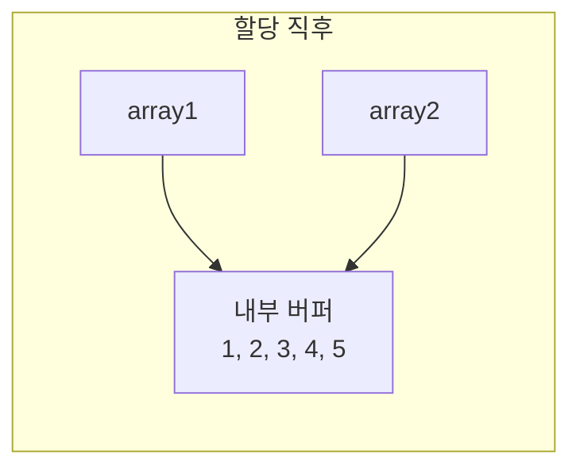
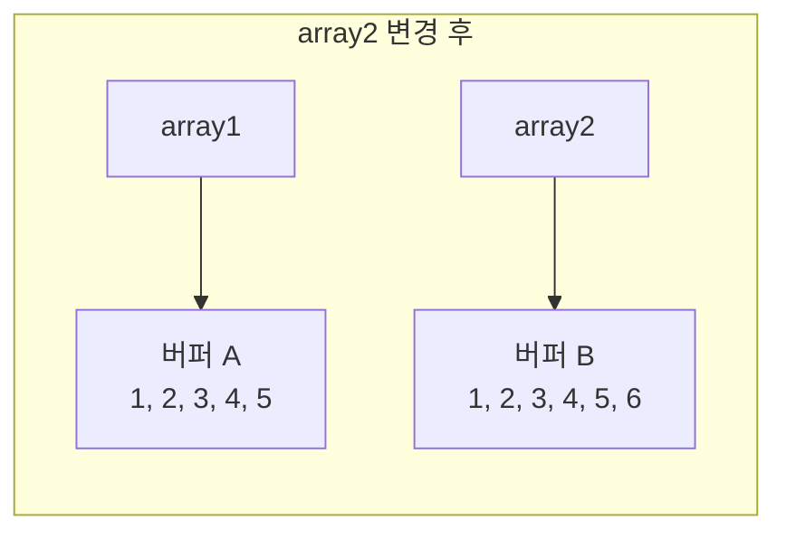

# Chapter 1. Swift 타입 시스템의 깊은 이해

> Swift의 타입 시스템은 단순히 컴파일 에러를 잡아주는 도구가 아닙니다. 값 타입과 참조 타입의 선택, 프로토콜의 존재적 타입(Existential Type)과 불투명 타입(Opaque Type)의 차이 — 이 결정들이 앱의 성능과 아키텍처를 근본적으로 좌우합니다. 이 장에서는 Swift 타입 시스템의 내부 동작을 이해하고, 실무에서 올바른 선택을 내릴 수 있는 기준을 세웁니다.

---

## 1.1 값 타입 vs 참조 타입 — 성능 관점에서 다시 보기

"구조체는 값 타입이고 클래스는 참조 타입이다." 이 사실은 이미 알고 있을 것입니다. 하지만 **왜** Swift 표준 라이브러리의 대부분이 구조체로 구현되어 있는지, 값 타입의 선택이 **성능에 어떤 영향**을 미치는지 깊이 들여다본 적이 있나요?

### 스택과 힙 — 메모리 할당의 비용

값 타입은 스택(Stack)에, 참조 타입은 힙(Heap)에 할당됩니다. 이 차이가 성능에 미치는 영향은 생각보다 큽니다.

```swift
// 값 타입: 스택 할당
struct Point {
    var x: Double
    var y: Double
}

// 참조 타입: 힙 할당
class PointClass {
    var x: Double
    var y: Double
    
    init(x: Double, y: Double) {
        self.x = x
        self.y = y
    }
}
```

스택 할당은 단순히 스택 포인터를 이동시키는 것으로 끝납니다. O(1) 연산입니다. 반면 힙 할당은 다음 과정을 거칩니다:

1. **빈 메모리 블록 탐색** — 힙에서 적절한 크기의 빈 공간을 찾습니다.
2. **메모리 할당** — 해당 블록을 사용 중으로 표시합니다.
3. **스레드 안전성 보장** — 힙은 여러 스레드가 공유하므로 락(lock) 또는 원자적 연산이 필요합니다.
4. **해제 시 정리** — 레퍼런스 카운팅과 메모리 반환이 필요합니다.

> **Note**: 단일 객체의 할당/해제 비용은 미미합니다. 하지만 초당 수천 번 반복되는 루프 내에서는 누적 비용이 무시할 수 없습니다. 특히 SwiftUI의 `body` 연산처럼 빈번하게 호출되는 코드에서 이 차이가 드러납니다.

### 구조체의 메모리 레이아웃 — MemoryLayout으로 들여다보기

🔴 고급

Swift는 `MemoryLayout<T>`를 통해 타입의 메모리 레이아웃을 정확하게 확인할 수 있습니다. `size`, `stride`, `alignment` 세 가지 속성의 차이를 이해하는 것이 중요합니다.

```swift
struct Point {
    var x: Double  // 8바이트
    var y: Double  // 8바이트
}

print(MemoryLayout<Point>.size)       // 16 — 실제 데이터 크기
print(MemoryLayout<Point>.stride)     // 16 — 배열에서 요소 간 거리
print(MemoryLayout<Point>.alignment)  // 8  — 메모리 정렬 단위
```

`size`는 타입이 차지하는 실제 바이트 수이고, `stride`는 배열에서 연속된 요소 사이의 거리입니다. `alignment`는 해당 타입이 메모리에서 시작해야 하는 주소의 배수를 나타냅니다.

### 메모리 배치 3대 규칙

패딩(padding)이 왜 발생하고, 프로퍼티 순서가 왜 중요한지 이해하려면 메모리 배치 규칙을 정확히 알아야 합니다.

**규칙 1 — 필드별 정렬**: 각 필드는 **자기 타입의 alignment 배수** 오프셋에 배치됩니다. `Double`(alignment 8)은 0, 8, 16... 위치에만, `Bool`(alignment 1)은 아무 위치에나 올 수 있습니다.

**규칙 2 — 구조체 정렬**: 구조체 전체의 alignment는 **필드 중 가장 큰 alignment** 값을 따릅니다.

**규칙 3 — stride 계산**: `stride`는 `size`를 구조체 alignment의 배수로 **올림**한 값입니다. 배열에서 다음 요소의 시작 주소를 정렬하기 위함입니다.

주요 타입별 alignment:

| 타입 | size | alignment | 배치 가능 오프셋 |
|------|------|-----------|-----------------|
| `Bool` | 1 | 1 | 0, 1, 2, 3... 아무 곳이나 |
| `Int8` / `UInt8` | 1 | 1 | 아무 곳이나 |
| `Int16` | 2 | 2 | 0, 2, 4, 6... 짝수만 |
| `Int32` / `Float` | 4 | 4 | 0, 4, 8, 12... |
| `Int64` / `Double` | 8 | 8 | 0, 8, 16, 24... |

### 패딩이 발생하는 경우 — 프로퍼티 순서의 함정

이 규칙을 `Padded` 구조체에 적용해봅시다:

```swift
struct Padded {
    var a: Bool    // alignment 1
    var b: Double  // alignment 8
    var c: Bool    // alignment 1
}

print(MemoryLayout<Padded>.size)       // 17
print(MemoryLayout<Padded>.stride)     // 24
print(MemoryLayout<Padded>.alignment)  // 8
```

메모리에 어떻게 배치되는지 바이트 단위로 보면:

```text
오프셋:  0    1  2  3  4  5  6  7    8  9 10 11 12 13 14 15   16
       ┌────┬──────────────────────┬────────────────────────┬────┐
       │ a  │   패딩 (7바이트)      │  b (Double, 8바이트)    │ c  │
       └────┴──────────────────────┴────────────────────────┴────┘

a (Bool):   오프셋 0  → 1의 배수 ✓
b (Double): 오프셋 8  → 8의 배수 ✓ (오프셋 1~7은 건너뜀 = 패딩 7바이트!)
c (Bool):   오프셋 16 → 1의 배수 ✓

size = 17, alignment = 8 (Double 때문)
stride = 24 (17을 8의 배수로 올림)
```

`a`(Bool) 다음에 `b`(Double)를 배치하려면, **Double은 8의 배수 오프셋에만** 올 수 있으므로 오프셋 1이 아닌 오프셋 8까지 건너뛰어야 합니다. 이 사이의 7바이트가 패딩으로 낭비됩니다.

### 프로퍼티 순서 최적화 — 패딩 최소화

프로퍼티 순서를 바꾸면 같은 데이터를 훨씬 적은 메모리로 저장할 수 있습니다:

```swift
struct Compact {
    var b: Double  // alignment 8
    var a: Bool    // alignment 1
    var c: Bool    // alignment 1
}

print(MemoryLayout<Compact>.size)       // 10
print(MemoryLayout<Compact>.stride)     // 16
print(MemoryLayout<Compact>.alignment)  // 8
```

```text
오프셋:  0  1  2  3  4  5  6  7    8    9
       ┌────────────────────────┬────┬────┐
       │  b (Double, 8바이트)    │ a  │ c  │
       └────────────────────────┴────┴────┘

b (Double): 오프셋 0 → 8의 배수 ✓
a (Bool):   오프셋 8 → 1의 배수 ✓ (8의 배수일 필요 없음!)
c (Bool):   오프셋 9 → 1의 배수 ✓

size = 10, alignment = 8
stride = 16 (10을 8의 배수로 올림)
```

**핵심**: `Bool`은 alignment가 **1**이므로, 어떤 오프셋이든 배치 가능합니다. Double 바로 뒤 오프셋 8에 패딩 없이 바로 들어갑니다. `Padded`(stride 24) vs `Compact`(stride 16) — 같은 데이터인데 배열로 10,000개 저장하면 **80KB 차이**가 납니다.

### 배치 최적화 원칙

실무에서 구조체의 프로퍼티 순서를 결정할 때 다음 원칙을 따르면 패딩을 최소화할 수 있습니다:

1. **alignment가 큰 타입을 앞에** 배치합니다 (Double, Int64 → Int32 → Int16 → Bool).
2. **같은 alignment의 타입끼리 모아** 배치합니다.
3. **작은 타입은 뒤로** 몰면 패딩이 줄어듭니다.

```swift
// ❌ 비효율적: 작은 → 큰 → 작은 (패딩 발생)
struct Bad {
    var flag: Bool      // 1B + 패딩 7B
    var value: Double   // 8B
    var tag: UInt8      // 1B
}
// size: 17, stride: 24

// ✅ 효율적: 큰 → 작은 → 작은 (패딩 최소)
struct Good {
    var value: Double   // 8B
    var flag: Bool      // 1B
    var tag: UInt8      // 1B
}
// size: 10, stride: 16
```

> **Note**: Swift 컴파일러는 현재 구조체의 프로퍼티 순서를 자동으로 재배치하지 않습니다. C 언어와 마찬가지로, 선언 순서가 메모리 레이아웃에 직접 영향을 줍니다. 대부분의 앱 코드에서는 가독성이 우선이지만, 수만 개 이상의 인스턴스를 배열에 저장하는 성능 민감 코드에서는 프로퍼티 순서를 의식적으로 배치하는 것이 좋습니다.

### 참조 타입의 힙 구조 — 객체 헤더의 비밀

🔴 고급

클래스 인스턴스는 힙에 할당되며, 데이터 앞에 **객체 헤더(Object Header)**가 붙습니다. 64비트 시스템에서 이 헤더는 **16바이트**로 구성됩니다.

```text
Swift 클래스 인스턴스의 힙 메모리 구조 (64-bit)
┌─────────────────────────────────────┐
│ Metadata Pointer (8바이트)           │ ← 타입 메타데이터를 가리킴
│   vtable, 타입 정보, 프로토콜 적합성    │
├─────────────────────────────────────┤
│ Reference Count (8바이트)            │ ← strong / unowned / flags
│   strong RC + unowned RC + flags    │
├─────────────────────────────────────┤
│ 저장 프로퍼티 데이터...               │ ← 실제 데이터
└─────────────────────────────────────┘
```

`MemoryLayout<T>`로 struct와 class의 크기 차이를 직접 확인해봅시다.

```swift
struct PointStruct {
    var x: Double  // 8바이트
    var y: Double  // 8바이트
}

class PointClass {
    var x: Double = 0  // 8바이트
    var y: Double = 0  // 8바이트
}

// struct: 데이터 크기 그대로
print(MemoryLayout<PointStruct>.size)   // 16
print(MemoryLayout<PointStruct>.stride) // 16

// class 변수는 참조(포인터)이므로 항상 8바이트
print(MemoryLayout<PointClass>.size)    // 8  — 포인터 크기
print(MemoryLayout<PointClass>.stride)  // 8

// 힙에 할당된 실제 크기: 헤더(16) + 데이터(16) = 32바이트
// (+ malloc의 내부 정렬/오버헤드)
```

`class_getInstanceSize`를 사용하면 힙에서의 실제 인스턴스 크기를 확인할 수 있습니다.

```swift
import ObjectiveC

class ThreeDoubles {
    var a: Double = 0
    var b: Double = 0
    var c: Double = 0
}

print(class_getInstanceSize(ThreeDoubles.self))
// 40 — 헤더(16) + Double(8) × 3 = 40바이트
```

### withUnsafePointer로 주소 확인하기

🔴 고급

값 타입의 스택 주소와 참조 타입의 힙 주소를 직접 확인하면, 메모리 모델에 대한 이해가 더 구체적이 됩니다.

```swift
struct ValuePoint {
    var x: Double = 1.0
    var y: Double = 2.0
}

var vp1 = ValuePoint()
var vp2 = vp1  // 독립적인 복사

withUnsafePointer(to: &vp1) { p in
    print("vp1 주소: \(p)")  // 예: 0x7ff7bfeff2a0
}
withUnsafePointer(to: &vp2) { p in
    print("vp2 주소: \(p)")  // 예: 0x7ff7bfeff290 — 다른 주소
}

class RefPoint {
    var x: Double = 1.0
    var y: Double = 2.0
}

let rp1 = RefPoint()
let rp2 = rp1  // 같은 객체를 참조

print(Unmanaged.passUnretained(rp1).toOpaque())  // 예: 0x600000008000
print(Unmanaged.passUnretained(rp2).toOpaque())  // 예: 0x600000008000 — 같은 주소
```

값 타입은 복사 시 서로 다른 스택 주소를 갖지만, 참조 타입은 같은 힙 주소를 공유하는 것을 확인할 수 있습니다. 이것이 앞서 설명한 값 의미론과 참조 의미론의 물리적 근거입니다.

### 벤치마크로 확인하기

🟡 중급

실제로 얼마나 차이가 나는지 측정해봅시다.

```swift
import Foundation

struct ValuePoint {
    var x: Double
    var y: Double
}

class ReferencePoint {
    var x: Double
    var y: Double
    init(x: Double, y: Double) {
        self.x = x
        self.y = y
    }
}

func measureValueType() {
    let start = CFAbsoluteTimeGetCurrent()
    for _ in 0..<1_000_000 {
        var point = ValuePoint(x: 1.0, y: 2.0)
        point.x += 1.0  // 스택에서 직접 수정
    }
    let elapsed = CFAbsoluteTimeGetCurrent() - start
    print("값 타입: \(elapsed)초")
}

func measureReferenceType() {
    let start = CFAbsoluteTimeGetCurrent()
    for _ in 0..<1_000_000 {
        let point = ReferencePoint(x: 1.0, y: 2.0)
        point.x += 1.0  // 힙 객체에 대한 참조를 통해 수정
    }
    let elapsed = CFAbsoluteTimeGetCurrent() - start
    print("참조 타입: \(elapsed)초")
}
```

> **Warning**: 위 벤치마크는 개념 이해를 위한 것입니다. 실제 성능 측정에는 `XCTest`의 `measure` 블록이나 Swift Benchmark Suite를 사용하세요. 컴파일러 최적화로 인해 결과가 달라질 수 있습니다.

### 값 타입이 항상 빠른 것은 아니다

여기서 중요한 반전이 있습니다. 값 타입이라고 **항상** 스택에 할당되는 것은 아닙니다. 다음 상황에서 값 타입도 힙에 할당됩니다:

1. **클로저에 캡처될 때** — 클로저는 캡처한 값을 힙에 저장합니다.
2. **프로토콜 타입으로 사용될 때** — Existential Container가 힙 할당을 유발할 수 있습니다.
3. **크기가 큰 구조체** — 컴파일러가 판단하여 힙에 할당할 수 있습니다.
4. **참조 타입의 저장 프로퍼티일 때** — 값 타입이 클래스의 저장 프로퍼티로 들어가면, 그 인스턴스와 함께 힙에 위치합니다.

> **Note**: 엄밀히 말하면 할당 위치는 컴파일러가 결정합니다. "값 타입 = 스택"은 통용되는 단순화일 뿐, 위 사례처럼 힙에 놓이기도 하고 반대로 작은 값은 스택을 거치지 않고 레지스터에 직접 올라가기도 합니다(register promotion).

```swift
protocol Drawable {
    func draw()
}

struct Circle: Drawable {
    var radius: Double
    func draw() { /* ... */ }
}

// Existential Container에 저장됨
// Circle이 작으면 인라인, 크면 힙 할당
let shape: any Drawable = Circle(radius: 10)
```

이 내용은 1.3절 "Existential Type"에서 자세히 다룹니다.

### 값 의미론(Value Semantics)의 진정한 가치

성능보다 더 중요한 것은 **값 의미론**입니다. 값 타입을 사용하면 공유 상태(shared mutable state)에 의한 버그를 원천 차단할 수 있습니다.

```swift
// 참조 타입의 함정
class Settings {
    var fontSize: Int = 14
}

let defaultSettings = Settings()
let userSettings = defaultSettings  // 같은 객체를 참조!
userSettings.fontSize = 18

print(defaultSettings.fontSize) // 18 — 의도하지 않은 변경!
```

```swift
// 값 타입의 안전성
struct Settings {
    var fontSize: Int = 14
}

let defaultSettings = Settings()
var userSettings = defaultSettings  // 독립적인 복사본
userSettings.fontSize = 18

print(defaultSettings.fontSize) // 14 — 원본은 안전
```

이것이 Swift의 표준 라이브러리가 `Array`, `Dictionary`, `String` 같은 핵심 타입을 모두 구조체로 구현한 이유입니다. 하지만 배열을 복사할 때마다 모든 원소가 복사된다면 성능 문제가 생기지 않을까요? 이 질문의 답이 바로 다음 섹션의 주제입니다.

---

## 1.2 Copy-on-Write — 값 타입의 성능 비밀

Swift의 `Array`, `Dictionary`, `String` 같은 컬렉션 타입은 값 타입이면서도 불필요한 복사를 피합니다. 이 마법의 비밀이 바로 Copy-on-Write(COW)입니다.

### COW의 동작 원리

Copy-on-Write는 이름 그대로 **"쓰기 시점에 복사"** 합니다.

```swift
var array1 = [1, 2, 3, 4, 5]
var array2 = array1  // 이 시점에서는 복사가 일어나지 않음

// array1과 array2는 같은 내부 버퍼를 공유
// (레퍼런스 카운트만 증가)

array2.append(6)  // 이 시점에서 비로소 복사 발생!
// array2는 새로운 버퍼를 할당받고 데이터를 복사
```

[그림: Copy-on-Write 동작 다이어그램 — 할당 시점의 공유 상태와 변경 시점의 복사를 시각적으로 표현]





### isKnownUniquelyReferenced — COW의 핵심 함수

🟢 기본

Swift 표준 라이브러리는 `isKnownUniquelyReferenced(_:)` 함수를 사용하여 참조가 유일한지 확인합니다. 참조가 유일하다면 복사 없이 직접 수정할 수 있습니다.

```swift
final class StorageBuffer<T> {
    var elements: [T]
    
    init(_ elements: [T]) {
        self.elements = elements
    }
    
    func copy() -> StorageBuffer {
        StorageBuffer(elements)
    }
}

struct OptimizedArray<T> {
    private var storage: StorageBuffer<T>
    
    init(_ elements: [T] = []) {
        storage = StorageBuffer(elements)
    }
    
    // 변경 전에 유일한 참조인지 확인
    private mutating func ensureUnique() {
        if !isKnownUniquelyReferenced(&storage) {
            storage = storage.copy()
        }
    }
    
    mutating func append(_ element: T) {
        ensureUnique()  // 필요할 때만 복사
        storage.elements.append(element)
    }
    
    var count: Int {
        storage.elements.count
    }
}
```

### COW가 작동하지 않는 경우

주의해야 할 점이 있습니다. **직접 만든 구조체에는 COW가 자동으로 적용되지 않습니다.** `Array`, `Dictionary`, `String`은 Apple이 내부적으로 COW를 구현해 놓은 것이고, 우리가 만든 구조체는 그런 메커니즘이 없습니다.

구조체를 다른 변수에 할당하면, Swift는 **모든 저장 프로퍼티의 값을 하나씩 복사**합니다. 프로퍼티가 적을 때는 문제없지만, 프로퍼티가 많아지면 비용이 누적됩니다.

```swift
// 프로퍼티가 많은 구조체
struct AppState {
    var users = Array(repeating: 0, count: 10_000)
    var orders = Array(repeating: 0, count: 5_000)
    var products = Array(repeating: 0, count: 3_000)
    var cache: [String: Data] = [:]
    var settings: [String: String] = [:]
    var sessionToken: String = ""
    var lastSyncDate: Date = .now
    var retryCount: Int = 0
}

var state1 = AppState()
var state2 = state1
// 이 할당에서 일어나는 일:
// 1. users        → Array 값 복사 (내부 버퍼는 COW로 공유)
// 2. orders       → Array 값 복사 (내부 버퍼는 COW로 공유)
// 3. products     → Array 값 복사 (내부 버퍼는 COW로 공유)
// 4. cache        → Dictionary 값 복사 (내부 버퍼는 COW로 공유)
// 5. settings     → Dictionary 값 복사 (내부 버퍼는 COW로 공유)
// 6. sessionToken → String 값 복사 (내부 버퍼는 COW로 공유)
// 7. lastSyncDate → Date 값 복사 (Double 1개 — 단순 복사)
// 8. retryCount   → Int 값 복사 (단순 복사)
//
// Array/Dictionary/String의 내부 데이터는 공유되지만,
// 각 프로퍼티마다 참조 카운트 증가(retain) 비용이 발생!
// 프로퍼티 6개 × retain + 값 복사 2개 = 무시할 수 없는 오버헤드
```

이 비용은 **구조체를 사용할 때마다 반복**됩니다. 다른 변수에 할당할 때, 함수에 전달할 때, 함수에서 반환할 때 — 매번 모든 프로퍼티가 복사됩니다:

```swift
func process(_ state: AppState) {
    // state를 받을 때 모든 프로퍼티가 복사됨
    // users, orders, products... 전부!
}

process(state1)  // 여기서 8개 프로퍼티 전부 복사
process(state1)  // 또 전부 복사
// 구조체가 전달될 때마다 이 비용이 발생
```

반면 커스텀 COW를 적용하면, **포인터 하나만 복사**하면 됩니다:

```swift
// 커스텀 COW 적용 후
struct AppState {
    private class Storage { /* 모든 데이터 */ }
    private var storage: Storage  // 포인터 1개!
}

var state2 = state1
// Storage 포인터만 복사 → retain 1회로 끝
// 실제 데이터 복사는 state2를 수정할 때 발생
```

> **Note**: 프로퍼티가 2~3개인 작은 구조체에서는 이 비용이 무시할 만합니다. 하지만 앱의 전체 상태를 담는 큰 구조체이거나, 빈번하게 복사되는 경우(SwiftUI의 View body에서 전달 등)에는 커스텀 COW를 고려해야 합니다.

### 커스텀 COW 구현 패턴

🟡 중급

대용량 데이터를 가진 값 타입에 COW를 직접 구현하는 패턴입니다.

```swift
struct Document {
    // 실제 데이터를 참조 타입으로 감싸기
    private final class Storage {
        var text: String
        var pages: [Page]
        var metadata: [String: String]
        
        init(text: String, pages: [Page],
             metadata: [String: String]) {
            self.text = text
            self.pages = pages
            self.metadata = metadata
        }
        
        func copy() -> Storage {
            Storage(
                text: text,
                pages: pages,
                metadata: metadata
            )
        }
    }
    
    private var storage: Storage
    
    init(text: String = "",
         pages: [Page] = [],
         metadata: [String: String] = [:]) {
        storage = Storage(
            text: text,
            pages: pages,
            metadata: metadata
        )
    }
    
    // 읽기 — 복사 없음
    var text: String {
        storage.text
    }
    
    var pageCount: Int {
        storage.pages.count
    }
    
    // 쓰기 — 필요시에만 복사
    var mutableText: String {
        get { storage.text }
        set {
            ensureUnique()
            storage.text = newValue
        }
    }
    
    private mutating func ensureUnique() {
        if !isKnownUniquelyReferenced(&storage) {
            storage = storage.copy()
        }
    }
}
```

이 패턴은 4장 "메모리 관리와 성능 최적화"에서 더 심화된 형태로 다시 다룹니다.

---

## 1.3 Existential Type — 유연함의 대가

프로토콜을 타입으로 사용하는 것은 Swift에서 가장 흔한 패턴 중 하나입니다. 하지만 그 이면에는 **존재적 타입(Existential Type)**이라는 메커니즘이 작동하고 있으며, 이는 무시할 수 없는 성능 비용을 수반합니다.

### Existential Container의 구조

프로토콜 타입의 변수를 선언하면, Swift는 **Existential Container**라는 특별한 구조를 사용합니다.

```swift
protocol Animal {
    func speak()
}

struct Cat: Animal {
    var name: String
    func speak() { print("야옹") }
}

struct Dog: Animal {
    var name: String
    var breed: String
    func speak() { print("멍멍") }
}

// any Animal 타입 — Existential Container에 저장
let pet: any Animal = Cat(name: "나비")
```

Existential Container는 다음과 같은 구조를 가집니다:

```text
Existential Container (40바이트 on 64-bit)
┌─────────────────────────────────┐
│ Value Buffer (24바이트)          │ ← 인라인 저장 또는 힙 포인터
│   word0: ________________       │
│   word1: ________________       │
│   word2: ________________       │
├─────────────────────────────────┤
│ 타입 메타데이터 포인터           │ ← 이를 통해 VWT(복사/이동/해제) 접근
├─────────────────────────────────┤
│ Protocol Witness Table 포인터    │ ← 프로토콜 메서드 디스패치
└─────────────────────────────────┘
```

> **Note**: 흔히 네 번째 word를 "VWT 포인터"라고 단순화하지만(WWDC 2016 "Understanding Swift Performance"도 이 표현을 씀), Swift ABI상 컨테이너에 직접 저장되는 것은 **타입 메타데이터(type metadata) 포인터**입니다. VWT(Value Witness Table)는 메타데이터를 통해(메타데이터 포인터의 -1 오프셋) 접근합니다. word 개수(5 words)와 총 크기(40바이트)는 동일합니다.

Value Buffer는 24바이트(3 words)입니다. 실제 값이 24바이트 이하면 **인라인**으로 저장되고, 초과하면 **힙에 할당**한 뒤 포인터만 저장합니다.

```swift
// Cat: name(String) — String은 16바이트(2 words) 값 타입이며
// Value Buffer(24바이트) 안에 인라인 저장됨
// (작은 문자열은 small-string optimization으로 힙 버퍼 없이 인라인,
//  큰 문자열은 내부에 힙 버퍼 참조를 보관하지만 String 자체 크기는 16바이트로 동일)

// 하지만 큰 구조체라면?
struct Elephant: Animal {
    var name: String
    var weight: Double
    var age: Int
    var habitat: String
    // 24바이트 초과 → 힙 할당 발생!
    
    func speak() { print("뿌우") }
}
```

### Value Buffer 3-word 구조 실제 검증

🔴 고급

Existential Container의 크기를 `MemoryLayout`으로 직접 확인해봅시다.

```swift
protocol Animal {
    func speak()
}

print(MemoryLayout<any Animal>.size)       // 40
print(MemoryLayout<any Animal>.stride)     // 40
print(MemoryLayout<any Animal>.alignment)  // 8
```

40바이트는 정확히 5 words(64비트 기준)입니다: Value Buffer 3 words(24바이트) + VWT 포인터(8바이트) + PWT 포인터(8바이트). 프로토콜을 여러 개 준수하면 PWT 포인터가 추가됩니다.

```swift
protocol Runnable {
    func run()
}

// Animal & Runnable — PWT가 2개
print(MemoryLayout<any Animal & Runnable>.size)    // 48
print(MemoryLayout<any Animal & Runnable>.stride)  // 48
// 24(Value Buffer) + 8(VWT) + 8(PWT Animal) + 8(PWT Runnable)
```

### 인라인 저장 vs 힙 할당 임계점 — 직접 증명

🔴 고급

Value Buffer는 24바이트(3 words)입니다. 구조체의 크기가 이 임계점을 초과하면 힙 할당이 발생합니다. 이를 `MemoryLayout`과 실제 측정으로 증명해봅시다.

```swift
protocol P {}

// 24바이트 이하: 인라인 저장
struct Small: P {
    var a: Int64 = 0  // 8
    var b: Int64 = 0  // 8
    var c: Int64 = 0  // 8
}
print(MemoryLayout<Small>.size)  // 24 — Value Buffer에 딱 맞음

// 24바이트 초과: 힙 할당 발생
struct Large: P {
    var a: Int64 = 0  // 8
    var b: Int64 = 0  // 8
    var c: Int64 = 0  // 8
    var d: Int64 = 0  // 8  ← 초과!
}
print(MemoryLayout<Large>.size)  // 32 — Value Buffer에 들어가지 않음

// Existential Container 크기는 동일
print(MemoryLayout<any P>.size)  // 40 — 내용물과 무관하게 항상 40
```

핵심은 `any P`의 크기가 항상 40바이트로 고정된다는 것입니다. `Small`은 Value Buffer에 인라인으로 저장되지만, `Large`는 힙에 할당된 뒤 Value Buffer에 포인터만 저장됩니다. 즉 동일한 40바이트 컨테이너 안에서 전혀 다른 메모리 전략이 사용됩니다.

```swift
// 성능에 미치는 영향을 벤치마크로 확인
import Foundation

func measureExistentialCreation<T: P>(_ factory: () -> T, label: String) {
    let start = CFAbsoluteTimeGetCurrent()
    for _ in 0..<1_000_000 {
        let _: any P = factory()
    }
    let elapsed = CFAbsoluteTimeGetCurrent() - start
    print("\(label): \(elapsed)초")
}

measureExistentialCreation({ Small() }, label: "인라인 (24B)")
// 인라인 (24B): ~0.005초

measureExistentialCreation({ Large() }, label: "힙 할당 (32B)")
// 힙 할당 (32B): ~0.025초 — 약 5배 느림
```

> **Tip**: 프로토콜 타입으로 빈번하게 사용되는 구조체는 24바이트 이하로 유지하면 힙 할당을 피할 수 있습니다. `MemoryLayout<T>.size`로 미리 확인하는 습관을 들이세요. 단, 정확한 인라인 조건은 "3 words(24바이트) 이하 **그리고** bitwise-takable(이동이 단순 `memcpy`로 가능)"입니다. `weak` 참조를 포함하는 등 non-bitwise-takable 타입은 크기가 작아도 힙에 박싱될 수 있습니다.

### Value Witness Table(VWT)

🔴 고급

Existential Container의 네 번째 word는 **타입 메타데이터(type metadata) 포인터**이며, 이 메타데이터를 통해 **Value Witness Table(VWT)**에 접근합니다. VWT는 타입의 **생명주기 관리**를 담당하는 함수 테이블로, 다음 연산들의 구현을 포함합니다.

```text
Value Witness Table
┌──────────────────────────────────────┐
│ initializeBufferWithCopyOfBuffer     │ ← 버퍼 → 버퍼 복사
│ destroy                              │ ← 값 해제
│ initializeWithCopy                   │ ← 복사 초기화
│ assignWithCopy                       │ ← 복사 대입
│ initializeWithTake                   │ ← 이동 초기화
│ assignWithTake                       │ ← 이동 대입
│ size                                 │ ← 타입의 크기
│ stride                               │ ← 타입의 stride
│ flags                                │ ← 인라인 가능 여부 등
└──────────────────────────────────────┘
```

컴파일러가 구체 타입을 알 때는 이러한 연산을 직접 인라인으로 생성합니다. 하지만 `any` 타입을 통해 사용할 때는, 런타임에 VWT를 조회하여 해당 함수를 간접 호출해야 합니다. 예를 들어, `any Animal` 배열을 복사할 때:

1. 각 원소의 타입 메타데이터 포인터를 읽고, 이를 통해 VWT를 조회합니다.
2. VWT에서 `initializeWithCopy` 함수 포인터를 가져옵니다.
3. 해당 함수를 호출하여 값을 복사합니다.

구체 타입이라면 `memcpy` 한 번이면 끝나는 작업이, existential에서는 원소마다 간접 호출이 발생합니다.

### Protocol Witness Table(PWT) — 메서드 디스패치의 실체

🔴 고급

Existential Container의 다섯 번째 word는 **Protocol Witness Table(PWT)** 포인터입니다. PWT는 **프로토콜 메서드가 구체 타입의 어떤 메서드로 매핑되는지**를 담고 있습니다.

```text
Protocol Witness Table (Animal)
┌────────────────────────────────┐
│ protocol conformance descriptor│ ← 적합성 메타데이터
│ speak() → Cat.speak()         │ ← 프로토콜 메서드 → 구체 메서드
└────────────────────────────────┘
```

`any Animal` 변수에 대해 `speak()`를 호출하면 다음 과정을 거칩니다:

1. Existential Container에서 PWT 포인터를 읽습니다 (메모리 로드 1회).
2. PWT에서 `speak()` 메서드의 함수 포인터를 읽습니다 (메모리 로드 1회).
3. Value Buffer에서 실제 값의 주소를 가져옵니다 (인라인이면 직접, 힙이면 포인터 역참조).
4. 함수 포인터를 통해 간접 호출합니다.

이 과정은 클래스의 vtable 디스패치와 유사하지만, Value Buffer 접근이라는 추가 단계가 있어 약간 더 비쌉니다. 또한 간접 호출은 CPU의 분기 예측(branch prediction)을 어렵게 만들고, 인라이닝 최적화를 불가능하게 합니다.

### Existential이 제네릭보다 느린 이유 — SIL 관점

🔴 고급

같은 프로토콜 제약이라도 `any`와 제네릭(`some` 포함)은 완전히 다른 코드를 생성합니다.

```swift
// 제네릭: 컴파일러가 구체 타입별로 특수화 가능
func feedGeneric<T: Animal>(_ animal: T) {
    animal.speak()
}

// Existential: 항상 간접 호출
func feedExistential(_ animal: any Animal) {
    animal.speak()
}
```

`swiftc -emit-sil` 명령으로 생성되는 SIL(Swift Intermediate Language)을 비교하면 차이가 명확합니다.

```text
// 제네릭 — 특수화(specialization) 후
// feedGeneric<Cat>:
//   %0 = struct_extract %cat, #Cat.name
//   %1 = function_ref @Cat.speak()  ← 직접 함수 참조
//   apply %1(%0)                    ← 정적 호출 (인라이닝 가능)

// Existential
// feedExistential:
//   %0 = open_existential_addr %animal  ← existential 열기
//   %1 = witness_method %0, #Animal.speak  ← PWT에서 메서드 조회
//   apply %1(%0)                         ← 간접 호출 (인라이닝 불가)
```

제네릭 함수는 Whole Module Optimization이 활성화되면, 호출 시점에 사용된 구체 타입에 맞게 **별도의 함수 복사본**이 생성됩니다. `feedGeneric(Cat())`은 `feedGeneric<Cat>`이라는 Cat 전용 함수로 컴파일되어, `Cat.speak()`을 직접 호출하거나 인라인할 수 있습니다. 반면 `feedExistential`은 단 하나의 함수만 존재하며, 런타임에 PWT를 통해 매번 간접 호출을 수행합니다.

### 성능 영향: 정적 디스패치 vs 동적 디스패치

Existential Type의 두 번째 비용은 **동적 디스패치(Dynamic Dispatch)**입니다.

```swift
// 구체 타입 — 정적 디스패치 (컴파일 타임에 결정)
func feedCat(_ cat: Cat) {
    cat.speak()  // 컴파일러가 직접 Cat.speak()을 호출
}

// Existential Type — 동적 디스패치 (런타임에 결정)
func feedAnimal(_ animal: any Animal) {
    animal.speak()  // Protocol Witness Table을 통해 간접 호출
}
```

정적 디스패치에서는 컴파일러가 **인라이닝(inlining)**과 **특수화(specialization)** 같은 최적화를 적용할 수 있습니다. 동적 디스패치에서는 이러한 최적화가 불가능합니다.

> **Note**: "동적 디스패치 = 느리다"는 단순한 공식은 위험합니다. 대부분의 앱에서 이 비용은 미미합니다. 하지만 **고빈도 루프**, **컬렉션의 원소 타입**, **SwiftUI의 View body** 같은 성능 민감 영역에서는 고려할 가치가 있습니다.

### Swift 5.7 이후: `any` 키워드의 도입

`any` 키워드는 SE-0335("Introduce existential `any`")로 도입되어 단계적으로 적용되고 있습니다. 이는 단순한 문법 변경이 아니라, **개발자에게 성능 비용을 인식하게 하려는 의도적인 설계**입니다.

| 버전 | bare 프로토콜 사용에 대한 동작 |
|------|------------------------------|
| Swift 5.6 | `any` 키워드 도입. bare 사용 허용. |
| Swift 5.7~ | **연관 타입(`associatedtype`/`Self`) 제약이 있는** 프로토콜의 bare 사용에 경고. |
| Swift 6 (현재) | 위와 동일. 단순 프로토콜의 bare 사용은 경고 없이 컴파일됨. |
| `-enable-upcoming-feature ExistentialAny` 활성화 시 | 모든 bare 사용에 경고 (아직 에러는 아님). |
| 미래 언어 모드 | 에러로 승격 예정 (`#ExistentialAny`). |

```swift
// Swift 5.6 이전
let animals: [Animal] = [Cat(name: "나비"), Dog(name: "바둑", breed: "진돗개")]

// 권장 — 명시적으로 비용을 인식
let animals: [any Animal] = [Cat(name: "나비"), Dog(name: "바둑", breed: "진돗개")]
```

> **Note**: Swift 6.3 시점에도 단순 프로토콜의 `[P]` 같은 bare 사용은 여전히 경고 없이 컴파일됩니다. 다만 이는 과도기적 동작이며, 향후 `ExistentialAny` upcoming feature가 언어 모드로 승격되면 에러가 됩니다. 새 코드에서는 처음부터 `any`를 명시하는 것이 안전합니다. 미리 강제하려면 빌드 설정에 `-enable-upcoming-feature ExistentialAny`를 추가하세요.

`any`를 쓸 때마다 "여기서 정말 existential이 필요한가?"를 자문하라는 신호입니다.

---

## 1.4 `any` vs `some` — 올바른 선택 기준

Swift 5.1에서 도입된 `some`(Opaque Type)과 Swift 5.6의 `any`(Existential Type)는 모두 프로토콜과 함께 사용되지만, **본질적으로 다른 메커니즘**입니다. 이 둘의 차이를 정확히 이해하는 것이 Swift 타입 시스템 활용의 핵심입니다.

### 핵심 차이: 타입을 누가 결정하는가

```swift
// some: 구현 측이 타입을 결정 (호출자는 모름)
func makeAnimal() -> some Animal {
    Cat(name: "나비")  // 항상 Cat을 반환
    // 컴파일러는 반환 타입이 Cat임을 알고 있음
}

// any: 호출 시점에 어떤 타입이든 가능 (런타임에 결정)
func feedAnimal(_ animal: any Animal) {
    animal.speak()  // Cat일 수도, Dog일 수도 있음
}
```

| 특성 | `some` (Opaque Type) | `any` (Existential Type) |
|------|---------------------|-------------------------|
| 타입 결정 시점 | 컴파일 타임 | 런타임 |
| 실제 타입 노출 | 호출자에게 숨김 | 호출자에게 숨김 |
| 디스패치 | 정적 | 동적 |
| 인라이닝 가능 | 가능 | 불가 |
| 여러 타입 혼합 | 불가 | 가능 |
| 성능 비용 | 없음 | Existential Container |

### 컴파일러가 생성하는 코드의 차이

🔴 고급

`some`과 `any`의 성능 차이는 추상적인 이론이 아니라, 컴파일러가 **실제로 다른 코드를 생성**하기 때문에 발생합니다.

**`some` — 단형화(Monomorphization)**

`some` 키워드는 컴파일러에게 "이 자리에 하나의 구체 타입만 올 수 있다"는 보장을 제공합니다. 컴파일러는 이 정보를 활용하여 제네릭 코드를 구체 타입에 맞게 **특수화(specialize)**합니다. 이 과정을 단형화(monomorphization)라고 합니다.

```swift
func area(of shape: some Shape) -> Double {
    shape.area  // 컴파일 타임에 구체 타입의 area로 해석
}

// area(of: Circle(radius: 5))를 호출하면
// 컴파일러가 생성하는 코드는 사실상:
// func area_Circle(of shape: Circle) -> Double {
//     shape.area  // Circle.area를 직접 호출 또는 인라인
// }
```

**`any` — Existential 간접 호출**

`any`는 런타임에 어떤 타입이든 올 수 있으므로, 컴파일러는 PWT를 통한 간접 호출 코드를 생성합니다.

```swift
func area(of shape: any Shape) -> Double {
    shape.area  // 런타임에 PWT에서 area 메서드를 찾아 호출
}
// 하나의 함수만 존재하며, 매 호출마다 간접 호출 발생
```

### SIL로 확인하는 방법

🔴 고급

Swift Intermediate Language(SIL)를 통해 컴파일러가 생성하는 코드를 직접 확인할 수 있습니다.

```bash
# some 버전
echo '
protocol P { func f() }
struct S: P { func f() {} }
func callSome(_ x: some P) { x.f() }
func test() { callSome(S()) }
' > /tmp/some_test.swift

swiftc -emit-sil -O /tmp/some_test.swift 2>/dev/null | grep -A5 "callSome"
```

최적화된 SIL에서 `some` 버전은 **제네릭 특수화**가 적용되어, `witness_method` 호출 대신 구체 타입의 메서드가 직접 참조되거나 인라인됩니다. 핵심적으로 확인할 차이점은:

```text
// some (최적화 후): 정적 디스패치
%1 = function_ref @S.f()          // 직접 함수 참조
apply %1(%0)                       // 정적 호출

// any: 동적 디스패치
%1 = open_existential_addr %0      // existential 열기
%2 = witness_method %1, #P.f       // PWT에서 메서드 조회
apply %2(%1)                       // 간접 호출
```

`some`은 호출 대상이 컴파일 타임에 확정되므로, 컴파일러가 함수 본문을 호출 지점에 **인라인**할 수 있습니다. 인라인되면 함수 호출 오버헤드 자체가 사라지고, 이후 추가적인 상수 전파(constant propagation)와 죽은 코드 제거(dead code elimination) 등의 최적화 기회도 생깁니다.

### 성능 벤치마크: some vs any vs 구체 타입

🔴 고급

세 가지 호출 방식의 성능 차이를 측정해봅시다.

```swift
import Foundation

protocol Computable {
    func compute() -> Double
}

struct Calculator: Computable {
    var value: Double
    func compute() -> Double {
        value * value + value
    }
}

// 1. 구체 타입 직접 호출
func callConcrete(_ c: Calculator) -> Double {
    c.compute()
}

// 2. some (정적 디스패치)
func callSome(_ c: some Computable) -> Double {
    c.compute()
}

// 3. any (동적 디스패치)
func callAny(_ c: any Computable) -> Double {
    c.compute()
}

let calc = Calculator(value: 42.0)
let iterations = 10_000_000

// 구체 타입
var start = CFAbsoluteTimeGetCurrent()
var sum = 0.0
for _ in 0..<iterations {
    sum += callConcrete(calc)
}
print("구체 타입: \(CFAbsoluteTimeGetCurrent() - start)초")
// 구체 타입: ~0.008초

// some
start = CFAbsoluteTimeGetCurrent()
sum = 0.0
for _ in 0..<iterations {
    sum += callSome(calc)
}
print("some:     \(CFAbsoluteTimeGetCurrent() - start)초")
// some:     ~0.008초 — 구체 타입과 동등

// any
let anyCalc: any Computable = calc
start = CFAbsoluteTimeGetCurrent()
sum = 0.0
for _ in 0..<iterations {
    sum += callAny(anyCalc)
}
print("any:      \(CFAbsoluteTimeGetCurrent() - start)초")
// any:      ~0.035초 — 약 4~5배 느림
```

`some`은 구체 타입과 사실상 동일한 성능을 보입니다. 최적화 후 같은 코드가 생성되기 때문입니다. `any`는 PWT 조회와 간접 호출, 인라이닝 불가로 인해 수 배 느립니다.

> **Warning**: 이 벤치마크는 함수 본문이 매우 단순한 경우의 극단적인 비교입니다. 실제 앱에서 메서드 본문이 복잡하면 호출 오버헤드의 상대적 비중이 줄어듭니다. 하지만 타이트 루프에서 수백만 번 호출되는 코드라면 이 차이가 체감됩니다.

### 실무 선택 가이드

🟢 기본

**`some`을 기본으로 사용하세요.** `any`는 정말 필요할 때만 쓰세요.

```swift
// ✅ 좋음: some 사용 — 정적 디스패치, 최적화 가능
func makeShape() -> some Shape {
    Circle()
}

// ✅ 좋음: some을 매개변수에도 사용 가능 (Swift 5.7+)
func draw(_ shape: some Shape) {
    // shape의 구체 타입에 맞게 최적화됨
}

// ⚠️ any가 필요한 경우: 이종(heterogeneous) 컬렉션
let shapes: [any Shape] = [Circle(), Rectangle()]
// 서로 다른 타입을 하나의 배열에 담으려면 any 필수
```

### `any`가 반드시 필요한 상황

🟡 중급

다음 상황에서는 `some` 대신 `any`를 써야 합니다.

**1. 이종 컬렉션**

```swift
protocol Renderer {
    func render()
}

struct HTMLRenderer: Renderer {
    func render() { /* HTML 출력 */ }
}

struct PDFRenderer: Renderer {
    func render() { /* PDF 출력 */ }
}

// 서로 다른 타입을 하나의 배열로
let renderers: [any Renderer] = [
    HTMLRenderer(),
    PDFRenderer()
]
```

**2. 런타임에 타입이 결정되는 경우**

```swift
func createRenderer(for format: OutputFormat)
    -> any Renderer {
    switch format {
    case .html: return HTMLRenderer()
    case .pdf:  return PDFRenderer()
    }
    // 반환 타입이 분기에 따라 다르므로 some은 불가
}
```

**3. 프로퍼티로 저장할 때 구체 타입을 숨기고 싶은 경우**

```swift
class RenderingEngine {
    // any를 사용하여 구체 타입에 대한 의존성 제거
    private var renderer: any Renderer
    
    init(renderer: any Renderer) {
        self.renderer = renderer
    }
    
    func switchRenderer(to renderer: any Renderer) {
        self.renderer = renderer
    }
}
```

### some + Primary Associated Type — 최신 패턴

🔴 고급

Swift 5.7에서 도입된 **Primary Associated Type**과 `some`을 결합하면, 제네릭의 표현력과 `some`의 성능을 동시에 얻을 수 있습니다.

```swift
// Primary Associated Type 선언
protocol DataStore<Item> {
    associatedtype Item
    func fetch(id: String) async throws -> Item
    func save(_ item: Item) async throws
}

// some + Primary Associated Type
// 구체 타입은 숨기면서 Item이 User임을 명시
func makeUserStore() -> some DataStore<User> {
    CoreDataUserStore()
}

// any + Primary Associated Type도 가능
func createStore(
    for entity: EntityType
) -> any DataStore<User> {
    switch entity {
    case .local:  return CoreDataUserStore()
    case .remote: return APIUserStore()
    }
}
```

이 패턴은 2장 "제네릭과 프로토콜 고급 패턴"에서 더 깊이 다룹니다.

### SwiftUI에서의 `some` — View 프로토콜

SwiftUI에서 가장 자주 보는 `some`의 사용은 `body` 프로퍼티입니다.

```swift
struct ContentView: View {
    var body: some View {  // 항상 같은 구체 타입을 반환
        VStack {
            Text("Hello")
            Image(systemName: "star")
        }
        // 실제 반환 타입: VStack<TupleView<(Text, Image)>>
        // some View로 이 복잡한 타입을 숨김
    }
}
```

`some View`가 없다면 반환 타입을 `VStack<TupleView<(Text, Image)>>`처럼 써야 합니다. View 계층이 복잡해질수록 이 타입은 기하급수적으로 길어집니다. `some View`는 이 복잡성을 감추면서도 **정적 디스패치의 성능 이점**을 유지합니다.

> **Warning**: `body`의 반환 타입으로 `any View`를 사용하면 컴파일은 되지만, SwiftUI의 diffing 알고리즘이 최적으로 동작하지 못하고 성능이 저하됩니다. 항상 `some View`를 사용하세요.

---

## 1.5 타입 시스템 활용 실전 패턴

이 절에서는 앞에서 배운 개념들을 조합하여 실무에서 자주 만나는 패턴을 살펴봅니다.

### 패턴 1: Phantom Type으로 컴파일 타임 안전성 확보

🔴 고급

팬텀 타입(Phantom Type)은 실제로 인스턴스를 생성하지 않는 타입을 제네릭 매개변수로 사용하여, **잘못된 사용을 컴파일 타임에 방지**하는 기법입니다.

```swift
// 상태를 나타내는 팬텀 타입
enum Draft {}
enum Published {}

struct Article<Status> {
    let title: String
    let content: String
    let author: String
}

// Draft 상태에서만 편집 가능
extension Article where Status == Draft {
    func edit(content: String) -> Article<Draft> {
        Article<Draft>(
            title: title,
            content: content,
            author: author
        )
    }
    
    func publish() -> Article<Published> {
        Article<Published>(
            title: title,
            content: content,
            author: author
        )
    }
}

// Published 상태에서만 공유 가능
extension Article where Status == Published {
    func shareURL() -> URL {
        // 발행된 글만 URL을 생성할 수 있음
        URL(string: "https://blog.example.com/\(title)")!
    }
}

// 사용
let draft = Article<Draft>(
    title: "Swift 타입 시스템",
    content: "...",
    author: "홍길동"
)
let edited = draft.edit(content: "수정된 내용")
let published = edited.publish()
let url = published.shareURL()

// ❌ 컴파일 에러: Draft 상태에서는 shareURL() 사용 불가
// draft.shareURL()

// ❌ 컴파일 에러: Published 상태에서는 edit() 사용 불가
// published.edit(content: "...")
```

### 패턴 2: 타입 안전한 식별자

🟡 중급

`String`이나 `Int`를 ID로 사용하면 서로 다른 엔터티의 ID를 혼동할 수 있습니다.

```swift
// ❌ 위험: 서로 다른 ID를 혼동할 수 있음
func fetchUser(id: String) -> User? { /* ... */ }
func fetchOrder(id: String) -> Order? { /* ... */ }

let userId = "user_123"
let orderId = "order_456"
fetchUser(id: orderId)  // 컴파일 에러가 나지 않음!
```

```swift
// ✅ 안전: 제네릭을 활용한 타입 안전 식별자
struct Identifier<Entity>: Hashable {
    let rawValue: String
}

struct User {
    let id: Identifier<User>
    let name: String
}

struct Order {
    let id: Identifier<Order>
    let amount: Decimal
}

func fetchUser(id: Identifier<User>) -> User? {
    /* ... */
    return nil
}

let userId = Identifier<User>(rawValue: "user_123")
let orderId = Identifier<Order>(rawValue: "order_456")

fetchUser(id: userId)   // ✅ 정상
// fetchUser(id: orderId)  // ❌ 컴파일 에러: Order ID를 User 파라미터에 넘길 수 없음
```

### 패턴 3: Result Builder와 타입 시스템

🟡 중급

SwiftUI의 `@ViewBuilder`는 Result Builder의 대표적인 활용입니다. 타입 시스템과 결합하여 DSL(Domain-Specific Language)을 만들 수 있습니다.

```swift
@resultBuilder
struct HTMLBuilder {
    static func buildBlock(
        _ components: HTMLNode...
    ) -> [HTMLNode] {
        components
    }
    
    static func buildOptional(
        _ component: [HTMLNode]?
    ) -> [HTMLNode] {
        component ?? []
    }
    
    static func buildEither(
        first component: [HTMLNode]
    ) -> [HTMLNode] {
        component
    }
    
    static func buildEither(
        second component: [HTMLNode]
    ) -> [HTMLNode] {
        component
    }
}

protocol HTMLNode {
    func render() -> String
}

struct Paragraph: HTMLNode {
    let text: String
    func render() -> String { "<p>\(text)</p>" }
}

struct Header: HTMLNode {
    let level: Int
    let text: String
    func render() -> String {
        "<h\(level)>\(text)</h\(level)>"
    }
}

struct HTMLDocument {
    let children: [HTMLNode]
    
    init(@HTMLBuilder content: () -> [HTMLNode]) {
        children = content()
    }
    
    func render() -> String {
        children.map { $0.render() }.joined(separator: "\n")
    }
}

// 사용: SwiftUI와 유사한 선언적 문법
let doc = HTMLDocument {
    Header(level: 1, text: "Swift 타입 시스템")
    Paragraph(text: "값 타입과 참조 타입의 차이를 알아봅니다.")
    Paragraph(text: "Copy-on-Write의 동작 원리를 이해합니다.")
}

print(doc.render())
```

---

## 1.6 Swift 컴파일러 최적화와 타입 시스템

Swift의 타입 시스템은 단순히 안전성을 위한 것이 아닙니다. 풍부한 타입 정보 덕분에 컴파일러가 **공격적인 최적화**를 수행할 수 있습니다. 이 절에서는 타입 시스템과 직결되는 주요 컴파일러 최적화를 살펴봅니다.

### 제네릭 특수화(Generic Specialization)

🔴 고급

제네릭 함수는 원래 **타입에 독립적인 하나의 함수**로 컴파일됩니다. 내부적으로 VWT와 PWT를 사용하여 값을 복사하고 메서드를 호출합니다. 이 방식은 코드 크기는 작지만, 간접 호출 비용이 발생합니다.

**제네릭 특수화(Generic Specialization)**는 컴파일러가 제네릭 함수를 호출 시점에 사용된 **구체 타입별로 복사**하여 별도의 함수를 생성하는 최적화입니다.

```swift
func swapValues<T>(_ a: inout T, _ b: inout T) {
    let temp = a
    a = b
    b = temp
}

var x = 42
var y = 99
swapValues(&x, &y)  // Int 전용 swapValues<Int>가 생성됨

var s1 = "hello"
var s2 = "world"
swapValues(&s1, &s2)  // String 전용 swapValues<String>이 생성됨
```

특수화 후 `swapValues<Int>`는 VWT를 거치지 않고 **8바이트 메모리 교환**으로 직접 컴파일됩니다. 함수가 충분히 작으면 호출 지점에 **인라인**되어 함수 호출 자체가 사라집니다.

```text
// 특수화 전 (제네릭)
// swapValues<T>:
//   %vwt = value_witness_table T
//   %copy = witness_method %vwt, #initializeWithCopy
//   apply %copy(...)      // 간접 호출로 복사

// 특수화 후 (Int)
// swapValues_Int:
//   %temp = load %a        // 직접 8바이트 로드
//   store %b, %a           // 직접 8바이트 저장
//   store %temp, %b        // 직접 8바이트 저장
```

> **Note**: 제네릭 특수화는 컴파일러가 호출 지점에서 구체 타입을 알 수 있을 때만 가능합니다. 모듈 경계를 넘어 호출되는 경우에는 기본적으로 특수화가 불가능합니다 — 이를 가능하게 하는 것이 `@inlinable`입니다.

### 인라이닝(Inlining)과 @inlinable

🔴 고급

**인라이닝**은 함수 호출을 함수 본문으로 대체하는 최적화입니다. 호출 오버헤드를 제거하고, 이후 상수 전파, 죽은 코드 제거 등 추가 최적화의 기회를 만들어줍니다.

같은 모듈 내에서는 컴파일러가 자유롭게 인라이닝을 수행합니다. 하지만 **모듈 경계**를 넘는 호출(예: 라이브러리의 함수를 앱에서 호출)에서는 함수 본문이 보이지 않아 인라이닝이 불가능합니다.

`@inlinable` 어트리뷰트는 함수의 본문을 **모듈 인터페이스에 공개**하여, 다른 모듈에서도 인라이닝과 제네릭 특수화가 가능하게 합니다.

```swift
// 라이브러리 모듈에서
public struct Stack<Element> {
    @usableFromInline
    internal var storage: [Element] = []
    
    public init() {}
    
    // @inlinable: 이 함수의 본문이 모듈 인터페이스에 포함됨
    @inlinable
    public mutating func push(_ element: Element) {
        storage.append(element)
    }
    
    @inlinable
    public mutating func pop() -> Element? {
        storage.popLast()
    }
    
    // @inlinable이 아닌 함수: 본문이 숨겨짐
    public func printAll() {
        storage.forEach { print($0) }
    }
}
```

`@inlinable`의 트레이드오프를 이해해야 합니다:

| 장점 | 단점 |
|------|------|
| 모듈 경계에서도 인라이닝 가능 | 함수 본문이 ABI의 일부가 됨 |
| 제네릭 특수화 가능 | 본문 변경 시 사용 측 재컴파일 필요 |
| 성능 최적화 극대화 | 바이너리 크기 증가 가능 |

> **Warning**: `@inlinable`은 한번 공개하면 **함수 본문이 라이브러리의 공개 계약(contract)**이 됩니다. 내부 구현을 자유롭게 바꿀 수 없게 되므로, 안정화된 함수에만 적용하세요. Swift 표준 라이브러리의 성능 핵심 함수들(`Array.append`, `Dictionary.subscript` 등)이 `@inlinable`로 선언되어 있는 이유입니다.

### Whole Module Optimization(WMO)

🔴 고급

기본적으로 Swift 컴파일러는 **파일 단위**로 컴파일합니다. 이 경우 A 파일의 함수를 B 파일에서 호출할 때, A 파일의 함수 본문을 참조할 수 없어 최적화 기회가 제한됩니다.

**Whole Module Optimization(WMO)**을 활성화하면 모듈 내 **모든 소스 파일을 하나의 단위**로 컴파일하여, 파일 경계를 넘는 인라이닝과 제네릭 특수화가 가능해집니다.

Xcode에서 활성화하는 방법:

```text
Build Settings → Swift Compiler - Code Generation
→ Compilation Mode → Whole Module
```

또는 커맨드라인에서:

```bash
swiftc -whole-module-optimization main.swift utils.swift -O -o myapp
```

WMO가 활성화되면 컴파일러는 다음 추가 최적화를 수행합니다:

1. **모듈 내 모든 제네릭 호출에 대한 특수화** — 파일이 달라도 구체 타입을 추적합니다.
2. **`internal` 접근 수준의 함수/타입 인라이닝** — 파일 경계를 넘어 본문을 참조합니다.
3. **사용되지 않는 코드 제거** — 모듈 전체를 분석하여 호출되지 않는 `internal` 함수를 제거합니다.
4. **`internal` 클래스의 vtable 최적화** — 하위 클래스가 없음이 확인되면 `final`로 취급하여 정적 디스패치로 전환합니다.

> **Tip**: Xcode의 기본 설정에서 Debug 빌드는 Incremental(파일 단위), Release 빌드는 Whole Module입니다. Release 빌드에서 성능이 크게 향상되는 이유 중 하나가 WMO입니다.

### swiftc -emit-sil 사용 예시

🔴 고급

SIL을 직접 확인하면 컴파일러가 타입 정보를 어떻게 활용하는지 눈으로 볼 수 있습니다. 간단한 예시를 통해 사용법을 익혀봅시다.

```bash
# 소스 파일 준비
cat > /tmp/sil_demo.swift << 'SWIFT'
protocol Describable {
    func describe() -> String
}

struct Dog: Describable {
    var name: String
    func describe() -> String { "Dog: \(name)" }
}

func greetGeneric<T: Describable>(_ item: T) -> String {
    item.describe()
}

func greetExistential(_ item: any Describable) -> String {
    item.describe()
}

let result1 = greetGeneric(Dog(name: "바둑"))
let result2 = greetExistential(Dog(name: "바둑"))
SWIFT

# 최적화 없이 SIL 출력
swiftc -emit-sil /tmp/sil_demo.swift 2>/dev/null | grep "witness_method"
# 출력: %N = witness_method $@opened("...") any Describable, #Describable.describe

# 최적화 적용 후 SIL 출력
swiftc -emit-sil -O /tmp/sil_demo.swift 2>/dev/null | grep -c "witness_method"
# 출력: 1 — 제네릭 버전의 witness_method가 특수화로 제거됨
```

최적화를 적용하면(`-O`), 제네릭 함수 `greetGeneric`에서의 `witness_method` 호출이 사라지고 `Dog.describe()`에 대한 직접 호출 또는 인라인 코드로 대체됩니다. 반면 existential 버전인 `greetExistential`의 `witness_method`는 그대로 남아 있습니다. 이것이 타입 시스템이 성능에 미치는 영향의 실체입니다.

> **Tip**: SIL을 완전히 이해할 필요는 없습니다. `witness_method`(간접 호출)와 `function_ref`(직접 참조)의 존재 여부만 확인해도 최적화 상태를 파악하는 데 충분합니다.

---

## 정리

이 장에서 다룬 핵심 내용을 정리합니다:

- **값 타입 vs 참조 타입**: 성능 차이의 근본 원인은 스택 vs 힙 할당에 있습니다. 하지만 값 타입의 더 큰 가치는 **값 의미론**을 통한 안전성입니다.

- **Copy-on-Write**: Swift 표준 라이브러리의 컬렉션은 COW를 통해 값 타입의 안전성과 참조 타입의 성능을 동시에 달성합니다. 대용량 커스텀 타입에는 직접 COW를 구현할 수 있습니다.

- **Existential Type**: `any` 프로토콜 타입은 Existential Container를 통해 동작하며, 힙 할당과 동적 디스패치 비용이 발생합니다. Swift 5.7에서 `any` 키워드를 명시하도록 한 것은 이 비용을 인식시키기 위함입니다.

- **`some` vs `any`**: `some`은 정적 디스패치로 성능 이점이 있고, `any`는 이종 컬렉션과 런타임 다형성이 필요할 때 사용합니다. **기본은 `some`, 필요할 때만 `any`**가 원칙입니다.

- **실전 패턴**: Phantom Type, 타입 안전 식별자, Result Builder 등을 통해 타입 시스템을 적극 활용하면 **런타임 버그를 컴파일 타임에 잡을 수 있습니다.**

- **컴파일러 최적화**: 제네릭 특수화, 인라이닝, Whole Module Optimization은 타입 시스템의 정보를 활용하여 런타임 성능을 극대화합니다. `some`과 제네릭이 `any`보다 빠른 이유도 이 최적화 파이프라인에 있습니다.

다음 장에서는 이 타입 시스템 위에 구축되는 **제네릭과 프로토콜의 고급 패턴**을 다룹니다.
