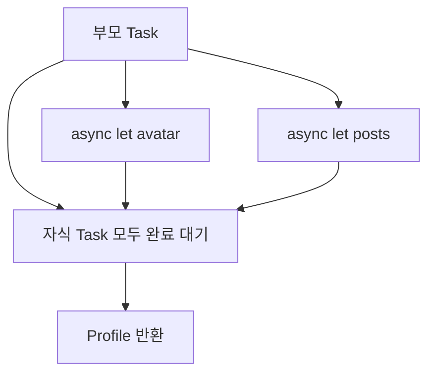

# Chapter 3. Swift Concurrency 완전 정복

> Swift 5.5에서 도입된 구조적 동시성(Structured Concurrency)은 비동기 프로그래밍의 패러다임을 근본적으로 바꿨습니다. GCD와 콜백 지옥에서 벗어나, 동기 코드처럼 읽히면서도 안전한 동시성 코드를 작성할 수 있게 되었습니다. 이 장에서는 async/await의 기본을 넘어, Actor, Sendable, TaskGroup의 깊은 이해와 실무 패턴을 다룹니다.

---

## 3.1 Structured Concurrency의 설계 철학

### 왜 구조적 동시성인가

GCD(Grand Central Dispatch)와 콜백 기반 비동기 코드의 근본적인 문제는 **비구조적(unstructured)**이라는 점입니다.

```swift
// ❌ 비구조적 동시성: GCD + 콜백
func fetchUserProfile(
    userId: String,
    completion: @escaping (Result<Profile, Error>) -> Void
) {
    fetchUser(userId: userId) { userResult in
        switch userResult {
        case .success(let user):
            fetchAvatar(url: user.avatarURL) { avatarResult in
                switch avatarResult {
                case .success(let avatar):
                    fetchPosts(userId: userId) { postsResult in
                        switch postsResult {
                        case .success(let posts):
                            let profile = Profile(
                                user: user,
                                avatar: avatar,
                                posts: posts
                            )
                            completion(.success(profile))
                        case .failure(let error):
                            completion(.failure(error))
                        }
                    }
                case .failure(let error):
                    completion(.failure(error))
                }
            }
        case .failure(let error):
            completion(.failure(error))
        }
    }
}
```

이 코드의 문제:
1. **콜백 지옥**: 중첩이 깊어질수록 읽기 어려움
2. **에러 전파 수동**: 모든 분기에서 에러를 직접 전달해야 함
3. **취소 불가**: 작업 취소 메커니즘이 내장되어 있지 않음
4. **생명주기 불명확**: 비동기 작업이 언제 완료되는지 구조적으로 보장할 수 없음

```swift
// ✅ 구조적 동시성: async/await
func fetchUserProfile(userId: String) async throws -> Profile {
    let user = try await fetchUser(userId: userId)
    
    async let avatar = fetchAvatar(url: user.avatarURL)
    async let posts = fetchPosts(userId: userId)
    
    return Profile(
        user: user,
        avatar: try await avatar,
        posts: try await posts
    )
}
```

동일한 로직이 **동기 코드처럼 선형적으로** 읽힙니다. 에러는 `throws`로 자동 전파되고, 취소는 내장되어 있으며, `async let`으로 병렬 실행도 자연스럽습니다.

### 구조적 동시성의 핵심 원칙

구조적 동시성의 "구조적"이란 다음을 의미합니다:

1. **자식 Task는 부모 Task의 범위 내에서 실행된다** — 부모가 끝나기 전에 모든 자식이 완료되어야 한다.
2. **취소는 자동으로 전파된다** — 부모가 취소되면 모든 자식도 취소된다.
3. **에러는 자동으로 전파된다** — 자식의 에러가 부모로 올라간다.
4. **우선순위가 상속된다** — 자식 Task는 부모의 우선순위를 물려받는다.



### Suspension Point 이해하기

`await` 키워드가 있는 곳이 바로 **중단 지점(Suspension Point)**입니다. 이 지점에서 현재 실행이 일시 중단되고, 스레드는 다른 작업을 처리할 수 있습니다.

```swift
func processOrder(_ order: Order) async throws -> Receipt {
    // ⬇️ 중단 지점 1: 결제 API 호출
    let payment = try await paymentService.charge(order.amount)
    
    // 이 코드는 payment가 완료된 후에만 실행됨
    // 하지만 같은 스레드가 아닐 수 있음!
    
    // ⬇️ 중단 지점 2: 재고 업데이트
    try await inventoryService.deduct(order.items)
    
    // ⬇️ 중단 지점 3: 영수증 생성
    let receipt = try await receiptService.generate(
        payment: payment,
        order: order
    )
    
    return receipt
}
```

> **Warning**: `await` 전후로 **같은 스레드에서 실행된다는 보장이 없습니다.** 따라서 스레드 로컬 저장소(Thread-Local Storage)에 의존하는 코드는 문제가 될 수 있습니다. 이것이 Actor가 필요한 이유 중 하나입니다.

---

## 3.2 Actor와 데이터 격리(Data Isolation)

### 데이터 레이스의 근본 원인

동시성 프로그래밍에서 가장 까다로운 문제는 **데이터 레이스(Data Race)**입니다. 여러 스레드가 동시에 같은 데이터를 읽고 쓸 때 발생합니다.

```swift
// ❌ 데이터 레이스 가능
class BankAccount {
    var balance: Int = 0
    
    func deposit(_ amount: Int) {
        balance += amount  // 읽기-수정-쓰기가 원자적이지 않음
    }
    
    func withdraw(_ amount: Int) -> Bool {
        guard balance >= amount else { return false }
        balance -= amount
        return true
    }
}

// 두 스레드에서 동시에 호출하면?
let account = BankAccount()
// Thread 1: account.deposit(100)
// Thread 2: account.withdraw(50)
// 결과가 예측 불가!
```

### Actor: 컴파일 타임 데이터 레이스 방지

Actor는 **자신의 상태에 대한 독점적 접근을 보장**합니다. 한 번에 하나의 Task만 Actor의 상태에 접근할 수 있습니다.

```swift
// ✅ Actor: 데이터 레이스 불가능
actor BankAccount {
    var balance: Int = 0
    
    func deposit(_ amount: Int) {
        balance += amount  // Actor 내부에서는 동기적 접근
    }
    
    func withdraw(_ amount: Int) -> Bool {
        guard balance >= amount else { return false }
        balance -= amount
        return true
    }
    
    // 여러 프로퍼티를 읽는 것도 안전
    var statement: String {
        "잔액: \(balance)원"
    }
}

// Actor 외부에서는 반드시 await 필요
let account = BankAccount()
await account.deposit(100)
let success = await account.withdraw(50)
print(await account.statement)
```

### Actor Reentrancy — 가장 흔한 함정

🔴 고급

Actor 메서드 내에서 `await`를 호출하면, 그 사이에 **다른 호출이 끼어들 수 있습니다.** 이것을 Actor 재진입(Reentrancy)이라고 합니다.

```swift
actor ImageCache {
    private var cache: [URL: Data] = [:]
    private var inProgress: [URL: Task<Data, Error>] = [:]
    
    // ❌ 위험: await 전후로 상태가 바뀔 수 있음
    func loadImageBad(from url: URL) async throws -> Data {
        if let cached = cache[url] {
            return cached
        }
        
        // ⚠️ 이 await 동안 다른 호출이 같은 URL을 요청할 수 있음
        let data = try await URLSession.shared
            .data(from: url).0
        
        cache[url] = data
        return data
        // 같은 URL에 대해 중복 네트워크 요청 발생!
    }
    
    // ✅ 안전: 진행 중인 요청을 추적
    func loadImage(from url: URL) async throws -> Data {
        if let cached = cache[url] {
            return cached
        }
        
        // 이미 진행 중인 요청이 있으면 그 결과를 기다림
        if let existing = inProgress[url] {
            return try await existing.value
        }
        
        let task = Task {
            try await URLSession.shared
                .data(from: url).0
        }
        
        inProgress[url] = task
        
        do {
            let data = try await task.value
            cache[url] = data
            inProgress.removeValue(forKey: url)
            return data
        } catch {
            inProgress.removeValue(forKey: url)
            throw error
        }
    }
}
```

> **Warning**: `await` 전에 확인한 조건이 `await` 후에도 여전히 유효하다고 가정하지 마세요. 이것이 Actor reentrancy의 핵심 함정입니다.

### Actor의 내부 구현 — Serial Executor

🔴 고급

Actor가 데이터 격리를 보장하는 핵심 메커니즘은 **Serial Executor**입니다. 각 Actor 인스턴스는 내부적으로 직렬 실행기(serial executor)를 보유하며, 이 실행기가 한 번에 하나의 작업만 Actor 위에서 실행되도록 보장합니다.

Actor에 메서드 호출이 도착하면 다음과 같은 과정을 거칩니다:

1. **호출 enqueue**: 외부에서 `await account.deposit(100)`을 호출하면, 이 작업은 Actor의 serial executor 큐에 추가됩니다.
2. **순차 실행**: Executor는 큐에 들어온 작업을 하나씩 꺼내 실행합니다. 현재 실행 중인 작업이 있으면 새 작업은 대기합니다.
3. **Suspension point에서 양보**: `await`를 만나면 현재 작업이 중단되고, 큐의 다음 작업이 실행될 수 있습니다 (이것이 reentrancy의 원인입니다).

```swift
actor Counter {
    var count = 0
    
    func increment() {
        // 이 함수 전체가 하나의 "job"으로 serial executor에서 실행됩니다.
        // 다른 increment() 호출은 이 실행이 끝날 때까지 대기합니다.
        count += 1
    }
    
    func incrementAfterDelay() async {
        count += 1          // ← job 1: 여기까지 실행
        // ⚠️ suspension point: 다른 작업이 끼어들 수 있음
        try? await Task.sleep(for: .seconds(1))
        count += 1          // ← job 2: 재개 후 실행
    }
}
```

내부적으로 Actor의 executor는 Swift 런타임의 **cooperative thread pool** 위에서 동작합니다. GCD의 serial queue와 유사한 개념이지만, cooperative scheduling을 사용하여 스레드 폭발(thread explosion) 문제를 방지합니다.

### Custom Executor — Actor의 실행 컨텍스트 커스터마이즈

🔴 고급

기본적으로 모든 Actor는 Swift 런타임의 기본 executor를 사용합니다. 하지만 `SerialExecutor` 프로토콜을 채택하여 **Actor가 어떤 실행 컨텍스트에서 동작할지** 직접 제어할 수 있습니다. 특정 DispatchQueue에서 실행해야 하거나, 하드웨어 관련 작업을 특정 스레드에 고정해야 할 때 유용합니다.

```swift
import Foundation

/// 특정 DispatchQueue에서 실행되는 Custom Executor
final class DispatchQueueExecutor: SerialExecutor {
    let queue: DispatchQueue
    
    init(queue: DispatchQueue) {
        self.queue = queue
    }
    
    func enqueue(_ job: consuming ExecutorJob) {
        let unownedJob = UnownedExecutorJob(job)
        queue.async {
            unownedJob.runSynchronously(
                on: self.asUnownedSerialExecutor()
            )
        }
    }
}

/// Custom executor를 사용하는 Actor
actor DatabaseActor {
    // 데이터베이스 작업 전용 직렬 큐
    private let executor = DispatchQueueExecutor(
        queue: DispatchQueue(label: "com.app.database")
    )
    
    // Actor의 executor를 커스텀으로 지정
    nonisolated var unownedExecutor: UnownedSerialExecutor {
        executor.asUnownedSerialExecutor()
    }
    
    private var connection: DatabaseConnection?
    
    func query(_ sql: String) async throws -> [Row] {
        // 항상 "com.app.database" 큐에서 실행됨
        guard let connection else {
            throw DatabaseError.notConnected
        }
        return try connection.execute(sql)
    }
    
    func connect(to url: URL) throws {
        // 이 메서드도 동일한 큐에서 실행
        connection = try DatabaseConnection(url: url)
    }
}
```

Custom executor의 주요 사용 사례:
- **레거시 코드 통합**: 특정 DispatchQueue에 바인딩된 기존 코드와 Actor를 연결할 때
- **하드웨어 접근**: 오디오, 카메라 등 특정 스레드에서만 접근해야 하는 리소스를 관리할 때
- **테스트**: 테스트 환경에서 executor를 교체하여 동시성 동작을 제어할 때

> **Note**: `MainActor`도 내부적으로 custom executor를 사용합니다. `MainActor`의 executor는 메인 스레드에서 작업을 실행하는 특수한 serial executor입니다.

### nonisolated — Actor 격리에서 벗어나기

Actor의 모든 메서드가 격리될 필요는 없습니다. 상태에 접근하지 않는 메서드는 `nonisolated`로 표시하여 `await` 없이 호출할 수 있습니다.

```swift
actor UserService {
    private var users: [String: User] = [:]
    
    func addUser(_ user: User) {
        users[user.id] = user
    }
    
    // 상태에 접근하지 않으므로 격리 불필요
    nonisolated func validate(email: String) -> Bool {
        let pattern = /^[A-Za-z0-9._%+-]+@[A-Za-z0-9.-]+\.[A-Z|a-z]{2,}$/
        return email.wholeMatch(of: pattern) != nil
    }
    
    // Codable, Hashable 등 프로토콜 준수 시에도 유용
    nonisolated var description: String {
        "UserService"
    }
}

let service = UserService()
// await 없이 바로 호출 가능
let isValid = service.validate(email: "test@example.com")
```

---

## 3.3 Sendable과 @Sendable의 실무 적용

### Sendable이 해결하는 문제

동시성 경계(concurrency boundary)를 넘어 데이터를 전달할 때, 그 데이터가 **안전하게 공유될 수 있는지** 컴파일러가 확인해야 합니다. 이것이 `Sendable` 프로토콜의 역할입니다.

```swift
// ✅ 값 타입은 기본적으로 Sendable
struct Coordinate: Sendable {
    var latitude: Double
    var longitude: Double
}

// ✅ 불변 클래스도 Sendable 가능
final class APIEndpoint: Sendable {
    let baseURL: URL
    let apiKey: String
    
    init(baseURL: URL, apiKey: String) {
        self.baseURL = baseURL
        self.apiKey = apiKey
    }
}

// ❌ 가변 상태가 있는 클래스는 Sendable 불가
// class MutableSettings: Sendable {
//     var theme: String = "light"  // 컴파일 에러!
// }
```

### Sendable 준수 규칙

| 타입 | Sendable 조건 |
|------|---------------|
| 값 타입 (struct, enum) | 모든 저장 프로퍼티가 Sendable |
| Actor | 항상 Sendable (격리를 보장하므로) |
| final class | 모든 저장 프로퍼티가 `let`이고 Sendable |
| 비-final class | Sendable 불가 (서브클래스가 가변 상태 추가 가능) |
| 함수/클로저 | `@Sendable`로 표시 |

### @Sendable 클로저

🟡 중급

`@Sendable` 클로저는 동시성 경계를 넘어 안전하게 전달할 수 있는 클로저입니다:

```swift
// Task.init의 클로저는 @Sendable
// 따라서 캡처하는 값은 Sendable이어야 함
func startBackgroundWork() {
    var counter = 0  // 로컬 변수
    
    Task {
        // ❌ 가변 로컬 변수를 캡처할 수 없음
        // counter += 1
    }
    
    let snapshot = counter  // 값을 복사
    Task {
        // ✅ 불변 값의 복사본은 안전
        print(snapshot)
    }
}
```

```swift
// 실무 패턴: @Sendable 클로저를 받는 API 설계
actor EventBus {
    private var handlers:
        [String: [@Sendable (Any) -> Void]] = [:]
    
    func subscribe(
        to event: String,
        handler: @escaping @Sendable (Any) -> Void
    ) {
        handlers[event, default: []].append(handler)
    }
    
    func emit(_ event: String, data: Any) {
        guard let eventHandlers = handlers[event]
        else { return }
        for handler in eventHandlers {
            handler(data)
        }
    }
}
```

### @unchecked Sendable — 최후의 수단

🔴 고급

자체적으로 스레드 안전성을 보장하는 타입에는 `@unchecked Sendable`을 사용할 수 있습니다:

```swift
// 내부적으로 락을 사용하여 스레드 안전성을 보장
final class ThreadSafeCache<Key: Hashable, Value>:
    @unchecked Sendable {
    private let lock = NSLock()
    private var storage: [Key: Value] = [:]
    
    func get(_ key: Key) -> Value? {
        lock.withLock { storage[key] }
    }
    
    func set(_ key: Key, value: Value) {
        lock.withLock { storage[key] = value }
    }
}
```

> **Warning**: `@unchecked Sendable`은 컴파일러의 안전 검사를 우회합니다. **스레드 안전성을 직접 보장**해야 하며, 이를 잘못 사용하면 런타임 크래시로 이어집니다. 가능하면 Actor를 사용하세요.

### Sendable의 컴파일러 검증 메커니즘

🔴 고급

컴파일러가 `Sendable` 준수 여부를 판단하는 과정은 **저장 프로퍼티의 재귀적 검사**입니다. 타입이 `Sendable`을 선언하면, 컴파일러는 모든 저장 프로퍼티의 타입이 `Sendable`인지 하나씩 확인합니다. 이 검사는 중첩된 타입까지 재귀적으로 내려갑니다.

```swift
struct Address: Sendable {
    let city: String      // ✅ String은 Sendable
    let zipCode: Int      // ✅ Int는 Sendable
}

struct Person: Sendable {
    let name: String      // ✅ String은 Sendable
    let address: Address  // ✅ Address는 Sendable (위에서 확인)
    let tags: [String]    // ✅ Array<String>은 Element가 Sendable이면 Sendable
}

// ❌ 컴파일 에러: Stored property 'delegate' of 'Sendable'-conforming
// struct 'Widget' has non-sendable type 'AnyObject'
struct Widget: Sendable {
    let id: String
    let delegate: AnyObject  // AnyObject는 Sendable이 아님
}
```

암시적 Sendable 추론도 이해해야 합니다. **frozen struct와 enum**은 모든 저장 프로퍼티(또는 associated value)가 Sendable이면 **암시적으로 Sendable**입니다. 명시적 선언 없이도 동작합니다:

```swift
// 명시적 Sendable 선언 없이도 Sendable로 추론됨
struct Point {
    var x: Double  // Sendable
    var y: Double  // Sendable
}
// Point는 암시적으로 Sendable

// 하지만 public API에서는 명시적 선언을 권장합니다
// (모듈 경계를 넘을 때 암시적 추론이 동작하지 않을 수 있음)
```

### `sending` 파라미터 (Swift 6.1)

🔴 고급

Swift 6.1에서 도입된 `sending` 키워드는 함수 파라미터나 반환값이 **호출자의 격리 도메인에서 완전히 전달(transfer)됨**을 나타냅니다. `Sendable`이 아닌 타입도 특정 조건에서 안전하게 동시성 경계를 넘을 수 있게 해줍니다.

```swift
// sending 파라미터: 호출 후 원래 도메인에서 더 이상 사용되지 않음을 보장
func processOnActor(_ item: sending MyClass) async {
    // item은 이 함수로 소유권이 완전히 이전됨
    await someActor.handle(item)
}

class MyClass {  // Sendable이 아님!
    var data: [String] = []
}

func example() async {
    let obj = MyClass()
    obj.data.append("hello")
    
    // ✅ obj의 소유권이 processOnActor로 이전됨
    await processOnActor(obj)
    
    // ❌ 컴파일 에러: obj는 이미 sending으로 전달됨
    // print(obj.data)
}
```

`sending`과 `@Sendable` 클로저의 차이:

| 특성 | `@Sendable` 클로저 | `sending` 파라미터 |
|------|--------------------|--------------------|
| 적용 대상 | 클로저/함수 타입 | 개별 파라미터 또는 반환값 |
| 요구 사항 | 캡처하는 모든 값이 Sendable | 해당 값이 전달 후 원래 도메인에서 사용 불가 |
| 유연성 | non-Sendable 타입 사용 불가 | non-Sendable도 소유권 이전 시 가능 |
| 도입 시기 | Swift 5.5 | Swift 6.1 |

### Region-based Isolation

🔴 고급

Swift 6의 **region-based isolation**은 Sendable 검사를 보다 지능적으로 수행합니다. 컴파일러가 값의 "영역(region)"을 추적하여, 실제로 동시 접근이 발생하지 않는 경우에는 non-Sendable 타입의 전달을 허용합니다.

```swift
class NonSendableConfig {
    var timeout: Int = 30
    var retryCount: Int = 3
}

actor Server {
    func configure(with config: sending NonSendableConfig) {
        // config를 안전하게 사용
        print("Timeout: \(config.timeout)")
    }
}

func setupServer() async {
    let server = Server()
    
    // ✅ Swift 6에서 허용: config는 이 함수에서 생성되어
    //    다른 곳에서 참조되지 않으므로 안전하게 전달 가능
    let config = NonSendableConfig()
    config.timeout = 60
    await server.configure(with: config)
    // config는 더 이상 이 영역에서 사용되지 않음
}
```

Region-based isolation이 거부하는 경우:

```swift
func unsafeSetup() async {
    let server = Server()
    let config = NonSendableConfig()
    
    // ❌ 컴파일 에러: config가 같은 영역에서 계속 참조됨
    await server.configure(with: config)
    print(config.timeout)  // 이 참조 때문에 전달 불가
}
```

이 메커니즘 덕분에 Swift 6에서 불필요한 `Sendable` 채택이나 `@unchecked Sendable` 사용을 크게 줄일 수 있습니다.

---

## 3.4 Task, TaskGroup, AsyncStream 패턴

### Task의 종류

Swift에는 두 종류의 Task가 있습니다:

```swift
// 1. 구조적 Task: async let, TaskGroup
func fetchDashboard() async throws -> Dashboard {
    // async let — 부모 Task의 자식으로 생성
    async let stats = fetchStats()
    async let notifications = fetchNotifications()
    async let profile = fetchProfile()
    
    return Dashboard(
        stats: try await stats,
        notifications: try await notifications,
        profile: try await profile
    )
    // 세 Task 모두 완료되어야 함수가 반환됨
}

// 2. 비구조적 Task: Task { }, Task.detached { }
func startUpload() {
    // 비구조적: 현재 컨텍스트에서 독립적으로 실행
    Task {
        // 부모의 Actor 컨텍스트와 우선순위를 상속
        try await uploadData()
    }
    
    Task.detached {
        // 완전히 독립: 컨텍스트 상속 없음
        try await compressLogs()
    }
}
```

### TaskGroup — 동적 병렬 처리

🟡 중급

`async let`은 컴파일 타임에 병렬 작업 수가 고정됩니다. 동적 개수의 작업을 병렬로 실행하려면 `TaskGroup`을 사용합니다.

```swift
func fetchAllUserAvatars(
    userIds: [String]
) async throws -> [String: UIImage] {
    try await withThrowingTaskGroup(
        of: (String, UIImage).self
    ) { group in
        for userId in userIds {
            group.addTask {
                let url = URL(
                    string: "https://api.example.com/avatar/\(userId)"
                )!
                let (data, _) = try await URLSession.shared
                    .data(from: url)
                let image = UIImage(data: data)!
                return (userId, image)
            }
        }
        
        var avatars: [String: UIImage] = [:]
        for try await (userId, image) in group {
            avatars[userId] = image
        }
        return avatars
    }
}
```

### TaskGroup에서 동시성 제한하기

🔴 고급

수백 개의 Task를 한꺼번에 생성하면 리소스 문제가 발생할 수 있습니다. 동시 실행 수를 제한하는 패턴:

```swift
func downloadFiles(
    urls: [URL],
    maxConcurrency: Int = 5
) async throws -> [URL: Data] {
    try await withThrowingTaskGroup(
        of: (URL, Data).self
    ) { group in
        var results: [URL: Data] = [:]
        var iterator = urls.makeIterator()
        
        // 초기 배치: maxConcurrency만큼만 시작
        for _ in 0..<min(maxConcurrency, urls.count) {
            if let url = iterator.next() {
                group.addTask {
                    let (data, _) = try await URLSession
                        .shared.data(from: url)
                    return (url, data)
                }
            }
        }
        
        // 하나가 완료될 때마다 새 작업 추가
        for try await (url, data) in group {
            results[url] = data
            
            if let nextURL = iterator.next() {
                group.addTask {
                    let (data, _) = try await URLSession
                        .shared.data(from: nextURL)
                    return (nextURL, data)
                }
            }
        }
        
        return results
    }
}
```

### Task 취소 처리

구조적 동시성의 장점 중 하나는 자동 취소입니다. 하지만 **취소를 확인하고 적절히 대응**하는 것은 개발자의 책임입니다.

```swift
func processLargeDataset(
    _ items: [DataItem]
) async throws -> [Result] {
    var results: [Result] = []
    
    for item in items {
        // 방법 1: 취소 확인 후 에러 던지기
        try Task.checkCancellation()
        
        // 방법 2: 취소 여부를 직접 확인
        if Task.isCancelled {
            // 정리 작업 수행
            await cleanupPartialResults(results)
            throw CancellationError()
        }
        
        let result = try await process(item)
        results.append(result)
    }
    
    return results
}
```

### AsyncStream — 비동기 시퀀스 만들기

🟡 중급

`AsyncStream`은 시간에 따라 값을 방출하는 비동기 시퀀스입니다. 콜백 기반 API를 async/await로 변환할 때 유용합니다.

```swift
// 콜백 기반 API를 AsyncStream으로 변환
class LocationManager {
    func locationStream() -> AsyncStream<CLLocation> {
        AsyncStream { continuation in
            let delegate = LocationDelegate(
                onUpdate: { location in
                    continuation.yield(location)
                },
                onError: { _ in
                    continuation.finish()
                }
            )
            
            // 스트림이 종료될 때 정리
            continuation.onTermination = { _ in
                delegate.stopUpdating()
            }
            
            delegate.startUpdating()
        }
    }
}

// 사용
func trackUserLocation() async {
    let manager = LocationManager()
    
    for await location in manager.locationStream() {
        print("위치: \(location.coordinate)")
        
        // 특정 조건에서 스트림 종료
        if location.horizontalAccuracy < 10 {
            break  // 자동으로 onTermination 호출
        }
    }
}
```

### AsyncStream의 버퍼링 전략

```swift
// 버퍼 정책 설정
func sensorStream() -> AsyncStream<SensorData> {
    AsyncStream(
        SensorData.self,
        bufferingPolicy: .bufferingNewest(10)
        // .bufferingOldest(10) — 오래된 것 유지
        // .unbounded — 무제한 (메모리 주의)
    ) { continuation in
        // 센서 데이터 방출...
    }
}
```

---

## 3.5 MainActor와 UI 업데이트 전략

### MainActor의 역할

`@MainActor`는 해당 코드가 **메인 스레드에서 실행됨을 보장**합니다. UIKit과 SwiftUI의 UI 업데이트는 반드시 메인 스레드에서 이루어져야 합니다.

```swift
// 타입 전체에 @MainActor 적용
@MainActor
class ProfileViewModel: ObservableObject {
    @Published var user: User?
    @Published var isLoading = false
    @Published var error: Error?
    
    func loadProfile(userId: String) async {
        isLoading = true
        defer { isLoading = false }
        
        do {
            // 네트워크 호출은 백그라운드에서 실행됨
            // await 후 다시 MainActor로 복귀
            user = try await APIClient.fetchUser(userId)
        } catch {
            self.error = error
        }
    }
}
```

### @MainActor vs DispatchQueue.main

```swift
// ❌ 옛날 방식: 런타임에만 메인 스레드 보장
class OldViewModel {
    func loadData() {
        URLSession.shared.dataTask(with: url) { data, _, _ in
            DispatchQueue.main.async {
                // 여기서 UI 업데이트
                // 실수로 main.async를 빼먹으면 크래시
            }
        }.resume()
    }
}

// ✅ Swift Concurrency: 컴파일 타임에 보장
@MainActor
class NewViewModel {
    var data: Data?
    
    func loadData() async throws {
        // await 전후 모두 MainActor에서 실행됨
        data = try await fetchData()
        // UI 업데이트가 자동으로 메인 스레드에서 실행
    }
}
```

### 성능 고려: MainActor에서 무거운 작업 피하기

🟡 중급

```swift
@MainActor
class ImageProcessor: ObservableObject {
    @Published var processedImage: UIImage?
    
    func processImage(_ original: UIImage) async {
        // ❌ 무거운 작업을 MainActor에서 실행하면 UI 프리징
        // let result = applyFilters(original)
        
        // ✅ 무거운 작업은 nonisolated 함수로 분리
        let result = await performHeavyProcessing(original)
        processedImage = result  // UI 업데이트만 MainActor
    }
    
    // nonisolated: MainActor 밖에서 실행
    nonisolated func performHeavyProcessing(
        _ image: UIImage
    ) async -> UIImage {
        // CPU 집약적 작업
        // MainActor 격리에서 벗어나 호출자의 executor에서 실행됨.
        // 별도 Task.detached 등으로 명시적으로 백그라운드를 지정할 수 있음
        await applyFilters(image)
    }
}
```

### SwiftUI에서의 동시성 패턴

```swift
struct UserProfileView: View {
    @State private var user: User?
    @State private var isLoading = false
    
    let userId: String
    
    var body: some View {
        Group {
            if isLoading {
                ProgressView()
            } else if let user {
                ProfileContent(user: user)
            }
        }
        .task {
            // .task는 View의 생명주기에 맞춰
            // 자동으로 Task를 생성하고 취소함
            isLoading = true
            defer { isLoading = false }
            
            do {
                user = try await fetchUser(userId)
            } catch {
                // 에러 처리
            }
        }
        .task(id: userId) {
            // userId가 바뀌면 이전 Task를 취소하고
            // 새 Task를 시작
            user = try? await fetchUser(userId)
        }
    }
}
```

---

## 3.6 실전 패턴: 동시성 설계 레시피

### 패턴 1: Actor 기반 캐시 매니저

🟡 중급

```swift
actor CacheManager<Key: Hashable & Sendable,
                    Value: Sendable> {
    private var cache: [Key: CacheEntry<Value>] = [:]
    private let maxAge: TimeInterval
    
    struct CacheEntry<V> {
        let value: V
        let timestamp: Date
        
        func isExpired(maxAge: TimeInterval) -> Bool {
            Date.now.timeIntervalSince(timestamp) > maxAge
        }
    }
    
    init(maxAge: TimeInterval = 300) {
        self.maxAge = maxAge
    }
    
    func get(_ key: Key) -> Value? {
        guard let entry = cache[key],
              !entry.isExpired(maxAge: maxAge) else {
            cache.removeValue(forKey: key)
            return nil
        }
        return entry.value
    }
    
    func set(_ key: Key, value: Value) {
        cache[key] = CacheEntry(
            value: value,
            timestamp: .now
        )
    }
    
    func getOrFetch(
        _ key: Key,
        fetch: @Sendable () async throws -> Value
    ) async throws -> Value {
        if let cached = get(key) {
            return cached
        }
        let value = try await fetch()
        set(key, value: value)
        return value
    }
    
    func clear() {
        cache.removeAll()
    }
}
```

### 패턴 2: 재시도 로직

```swift
func withRetry<T: Sendable>(
    maxAttempts: Int = 3,
    delay: Duration = .seconds(1),
    backoffMultiplier: Double = 2.0,
    operation: @Sendable () async throws -> T
) async throws -> T {
    var lastError: Error?
    var currentDelaySeconds = Double(delay.components.seconds)
    
    for attempt in 1...maxAttempts {
        do {
            return try await operation()
        } catch {
            lastError = error
            
            if attempt < maxAttempts {
                try await Task.sleep(for: .seconds(currentDelaySeconds))
                currentDelaySeconds *= backoffMultiplier
            }
        }
    }
    
    throw lastError!
}

// 사용
let data = try await withRetry(maxAttempts: 3) {
    try await fetchFromUnreliableAPI()
}
```

### 패턴 3: Debounce + AsyncStream

🔴 고급

검색어 입력처럼 빈번한 이벤트를 디바운스하는 패턴:

```swift
@MainActor
class SearchViewModel: ObservableObject {
    @Published var query = ""
    @Published var results: [SearchResult] = []
    
    private var searchTask: Task<Void, Never>?
    
    func onQueryChanged(_ newQuery: String) {
        searchTask?.cancel()
        
        guard !newQuery.isEmpty else {
            results = []
            return
        }
        
        searchTask = Task {
            // 300ms 디바운스
            try? await Task.sleep(for: .milliseconds(300))
            
            // 취소되었으면 여기서 종료
            guard !Task.isCancelled else { return }
            
            do {
                results = try await searchAPI(query: newQuery)
            } catch {
                if !(error is CancellationError) {
                    // 실제 에러 처리
                }
            }
        }
    }
}
```

---

## 3.7 Swift 6 Strict Concurrency 마이그레이션 실전

🔴 고급

Swift 6는 데이터 레이스를 **컴파일 에러**로 취급합니다. 기존 프로젝트를 Swift 6로 마이그레이션하는 것은 상당한 작업이 될 수 있지만, 단계적으로 접근하면 관리 가능합니다.

### 마이그레이션 3단계 전략

**1단계: Swift 5 모드 + Complete Concurrency Checking**

Xcode의 Build Settings에서 `Strict Concurrency Checking`을 `Complete`로 설정합니다. 이 단계에서는 모든 동시성 문제가 **경고**로 표시되므로 앱이 정상적으로 빌드됩니다.

```
// Package.swift (SwiftPM)
.target(
    name: "MyApp",
    swiftSettings: [
        .enableUpcomingFeature("StrictConcurrency")
    ]
)
```

**2단계: 경고를 하나씩 수정**

모듈 단위로 경고를 해결합니다. 의존 관계가 적은 하위 모듈부터 시작하는 것을 권장합니다.

**3단계: Swift 6 Language Mode 전환**

모든 경고가 해결되면 Swift 6 모드를 활성화합니다.

```
// Package.swift
.target(
    name: "MyApp",
    swiftSettings: [
        .swiftLanguageMode(.v6)
    ]
)
```

### 가장 흔한 Strict Concurrency 에러 패턴 5가지

#### 1. Capture of non-sendable type

```swift
// ❌ 에러: Capture of 'logger' with non-sendable type 'Logger'
//    in a '@Sendable' closure
class Logger {
    func log(_ message: String) { print(message) }
}

func startWork(logger: Logger) {
    Task {
        logger.log("작업 시작")  // Logger가 Sendable이 아님
    }
}

// ✅ 해결 방법 1: Logger를 Sendable로 만들기
final class Logger: Sendable {
    // 가변 상태가 없으므로 final class + Sendable 가능
    func log(_ message: String) { print(message) }
}

// ✅ 해결 방법 2: Actor로 전환
actor SafeLogger {
    func log(_ message: String) { print(message) }
}

// ✅ 해결 방법 3: 내부적으로 스레드 안전성을 보장하는 경우
final class Logger: @unchecked Sendable {
    private let lock = NSLock()
    private var logs: [String] = []
    
    func log(_ message: String) {
        lock.withLock { logs.append(message) }
    }
}
```

#### 2. Actor-isolated property cannot be referenced from non-isolated context

```swift
// ❌ 에러: Actor-isolated property 'count' can not be
//    referenced from a nonisolated context
actor Counter {
    var count = 0
}

func printCount(counter: Counter) {
    print(counter.count)  // 동기 컨텍스트에서 Actor 프로퍼티 접근
}

// ✅ 해결 방법 1: async 컨텍스트에서 await 사용
func printCount(counter: Counter) async {
    print(await counter.count)
}

// ✅ 해결 방법 2: Actor에 nonisolated 접근자 제공
actor Counter {
    var count = 0
    
    func getCount() -> Int { count }
}
```

#### 3. Global variable is not concurrency-safe

```swift
// ❌ 에러: Static property 'shared' is not concurrency-safe
//    because it is nonisolated global shared mutable state
class APIClient {
    static let shared = APIClient()
    var baseURL = "https://api.example.com"
}

// ✅ 해결 방법 1: @MainActor로 격리 (UI 관련 싱글톤)
@MainActor
class APIClient {
    static let shared = APIClient()
    var baseURL = "https://api.example.com"
}

// ✅ 해결 방법 2: Actor로 전환
actor APIClient {
    static let shared = APIClient()
    var baseURL = "https://api.example.com"
}

// ✅ 해결 방법 3: Sendable + 불변으로 만들기
final class APIClient: Sendable {
    static let shared = APIClient()
    let baseURL = "https://api.example.com"
}
```

#### 4. Passing argument of non-sendable type across actor boundary

```swift
// ❌ 에러: Passing argument of non-sendable type 'NSMutableArray'
//    outside of main actor-isolated context may introduce data races
@MainActor
func updateUI() async {
    let items = NSMutableArray(array: ["A", "B", "C"])
    
    await Task.detached {
        processItems(items)  // NSMutableArray는 Sendable이 아님
    }.value
}

// ✅ 해결 방법: Sendable 타입으로 변환 후 전달
@MainActor
func updateUI() async {
    let items = ["A", "B", "C"]  // Swift Array는 Sendable
    
    await Task.detached {
        processItems(items)
    }.value
}
```

#### 5. Main actor-isolated cannot be used from non-isolated context

```swift
// ❌ 에러: Main actor-isolated property 'text' can not be
//    mutated from a nonisolated context
@MainActor
class ViewModel: ObservableObject {
    @Published var text = ""
    
    func fetchData() async {
        let data = await loadFromNetwork()
        // 만약 이 함수가 nonisolated라면 text에 접근 불가
    }
}

// ✅ 해결: 함수도 @MainActor로 격리되어 있는지 확인
// 클래스 전체에 @MainActor가 적용되어 있으면 메서드도 자동으로 격리됨
@MainActor
class ViewModel: ObservableObject {
    @Published var text = ""
    
    // @MainActor가 클래스에서 상속되므로 안전
    func fetchData() async {
        let data = await loadFromNetwork()
        text = data  // ✅ MainActor 컨텍스트에서 접근
    }
    
    // 명시적으로 격리를 해제하는 경우 주의
    nonisolated func helper() async {
        // ❌ 여기서는 text에 접근 불가
        // text = "hello"
        
        // ✅ await로 MainActor 컨텍스트에 진입
        await MainActor.run {
            // self.text = "hello"  // 가능
        }
    }
}
```

### @preconcurrency import — 서드파티 라이브러리 호환

서드파티 라이브러리가 아직 Sendable을 채택하지 않았을 때, `@preconcurrency import`로 해당 모듈에서 오는 동시성 경고를 억제할 수 있습니다:

```swift
// 라이브러리가 Sendable을 지원하지 않을 때
@preconcurrency import SomeThirdPartyLibrary

// 이제 SomeThirdPartyLibrary의 타입에 대한
// Sendable 관련 경고가 억제됩니다.
// 라이브러리가 업데이트되면 @preconcurrency를 제거하세요.
```

> **Warning**: `@preconcurrency import`는 임시 방편입니다. 라이브러리가 Swift 6을 지원하면 제거해야 합니다. 이 키워드를 사용하면 해당 모듈에서 발생하는 실제 동시성 문제도 가려질 수 있습니다.

### 전역 변수 처리 — 옵션별 트레이드오프

Swift 6에서 전역 변수(global variable)와 static 프로퍼티는 동시성 안전성을 보장해야 합니다. 상황에 따라 다른 전략을 선택합니다:

```swift
// 원본: Swift 5에서는 문제 없지만 Swift 6에서 에러
var globalConfig = AppConfig()
static var shared = MyService()

// 옵션 1: let으로 전환 (불변이면 가장 좋은 방법)
let globalConfig = AppConfig()  // ✅ 불변이면 안전

// 옵션 2: @MainActor (UI 관련 전역 상태)
@MainActor
var globalConfig = AppConfig()  // MainActor에서만 접근 가능

// 옵션 3: nonisolated(unsafe) (최후의 수단)
// 스레드 안전성을 개발자가 직접 보장해야 함
nonisolated(unsafe) var globalConfig = AppConfig()
```

| 옵션 | 안전성 | 접근 편의성 | 사용 시점 |
|------|--------|-------------|-----------|
| `let` 전환 | 완전 보장 | 어디서든 접근 | 값이 변하지 않을 때 |
| `@MainActor` | 컴파일러 보장 | `await` 필요 (비격리 컨텍스트에서) | UI 관련 상태 |
| Actor로 전환 | 컴파일러 보장 | `await` 필요 | 가변 공유 상태 |
| `nonisolated(unsafe)` | 보장 없음 | 어디서든 접근 | 레거시 호환, 성능 임계 경로 |

> **Warning**: `nonisolated(unsafe)`는 `@unchecked Sendable`과 마찬가지로 컴파일러 검사를 우회합니다. C/Objective-C 라이브러리 연동이나 이미 자체적으로 동기화를 보장하는 전역 변수에만 제한적으로 사용하세요.

---

## 3.8 동시성 내부 구조: Task와 Continuation

🔴 고급

### Task의 내부 구조

Task는 Swift 런타임에서 힙에 할당되는 객체로, 비동기 작업의 전체 생명주기를 관리합니다. 각 Task는 다음 상태 정보를 보유합니다:

- **상태(Status)**: `running`, `suspended`, `completed` 중 하나
- **우선순위(Priority)**: `.high`, `.medium`, `.low`, `.userInitiated`, `.utility`, `.background`
- **취소 플래그(Cancellation Flag)**: 협력적(cooperative) 취소를 위한 Boolean 플래그
- **Task Local Values**: 태스크 계층 전체에서 공유되는 컨텍스트 값
- **부모 참조**: 구조적 동시성에서 부모-자식 관계 추적

```swift
// Task 상태 확인 예시
func demonstrateTaskProperties() async {
    let task = Task(priority: .high) {
        // 현재 Task의 우선순위 확인
        print("Priority: \(Task.currentPriority)")
        
        // 취소 여부 확인
        print("Cancelled: \(Task.isCancelled)")
        
        try await Task.sleep(for: .seconds(10))
        return "완료"
    }
    
    // 외부에서 Task 취소
    task.cancel()
    
    // Task의 결과 기다리기 (취소되었으므로 에러)
    do {
        let result = try await task.value
        print(result)
    } catch {
        print("Task 취소됨: \(error)")
    }
}
```

Task는 기존 스레드 기반 모델과 달리 **cooperative thread pool** 위에서 스케줄링됩니다. 시스템의 CPU 코어 수만큼의 스레드만 유지하며, `await` 시점에서 스레드를 양보하여 다른 Task가 사용할 수 있게 합니다. 이로 인해 수천 개의 Task를 생성해도 스레드 폭발이 발생하지 않습니다.

### Continuation 기반 실행 — async 함수의 동작 원리

async 함수는 내부적으로 **Continuation Passing Style(CPS)**로 변환됩니다. 각 `await` 지점(suspension point)에서 함수의 로컬 상태가 힙에 저장되고, 재개 시 해당 상태에서 실행이 이어집니다.

```swift
// 이 async 함수가...
func fetchAndProcess() async throws -> Result {
    let data = try await fetchData()    // suspension point 1
    let parsed = try await parse(data)  // suspension point 2
    return Result(parsed)
}

// 컴파일러 내부적으로는 대략 이런 구조로 변환됩니다
// (실제 구현은 더 복잡하지만 개념적으로):
//
// func fetchAndProcess(continuation: Continuation<Result>) {
//     fetchData { data in
//         // suspension point 1에서 재개
//         parse(data) { parsed in
//             // suspension point 2에서 재개
//             continuation.resume(returning: Result(parsed))
//         }
//     }
// }
```

이 변환 덕분에 async/await 코드가 동기 코드처럼 보이지만, 실제로는 각 `await`에서 실행이 중단되고 나중에 재개될 수 있습니다.

### withCheckedContinuation / withUnsafeContinuation

콜백 기반 API를 async/await로 변환할 때 Continuation을 직접 사용합니다. 가장 중요한 규칙은 **resume은 정확히 한 번만 호출해야 한다**는 것입니다.

```swift
// 콜백 기반 API
func legacyFetch(
    url: URL,
    completion: @escaping (Data?, Error?) -> Void
) {
    // ... 네트워크 요청 ...
}

// ✅ withCheckedContinuation: 안전한 변환
// resume이 0번 또는 2번 이상 호출되면 런타임 경고/크래시 발생
func fetch(url: URL) async throws -> Data {
    try await withCheckedThrowingContinuation { continuation in
        legacyFetch(url: url) { data, error in
            if let error {
                continuation.resume(throwing: error)
            } else if let data {
                continuation.resume(returning: data)
            } else {
                continuation.resume(
                    throwing: URLError(.unknown)
                )
            }
            // ⚠️ 여기서 또 resume을 호출하면 런타임 에러:
            // "SWIFT TASK CONTINUATION MISUSE:
            //  tried to resume its continuation more than once"
        }
    }
}

// withUnsafeContinuation: 검사 없는 고성능 버전
// resume 규칙 위반 시 정의되지 않은 동작 (크래시, 메모리 누수 등)
func fetchUnsafe(url: URL) async throws -> Data {
    try await withUnsafeThrowingContinuation { continuation in
        legacyFetch(url: url) { data, error in
            if let error {
                continuation.resume(throwing: error)
            } else if let data {
                continuation.resume(returning: data)
            } else {
                continuation.resume(
                    throwing: URLError(.unknown)
                )
            }
        }
    }
}
```

Continuation 사용 시 주의사항:

| 상황 | `withCheckedContinuation` | `withUnsafeContinuation` |
|------|---------------------------|--------------------------|
| resume 0회 | 런타임 경고 (누수 감지) | 정의되지 않은 동작 (영원히 대기) |
| resume 1회 | 정상 동작 | 정상 동작 |
| resume 2회 이상 | 런타임 크래시 (명확한 에러 메시지) | 정의되지 않은 동작 |
| 성능 | 약간의 오버헤드 | 오버헤드 없음 |
| 권장 시점 | 개발/디버그 | 프로덕션 성능 임계 경로 |

> **Tip**: 개발 중에는 항상 `withCheckedContinuation`을 사용하고, 성능이 중요한 코드에서만 `withUnsafeContinuation`으로 전환하세요. Checked 버전의 런타임 검사가 버그를 조기에 발견해줍니다.

### Task Local Values — @TaskLocal

🔴 고급

`@TaskLocal`은 Task 계층 전체에서 암시적으로 전파되는 컨텍스트 값입니다. 로깅, 트레이싱, 인증 토큰 전파 등에 유용합니다.

```swift
enum RequestContext {
    @TaskLocal static var requestID: String = "unknown"
    @TaskLocal static var userID: String?
}

// 로깅 시스템에서 자동으로 requestID를 포함
func log(_ message: String) {
    let rid = RequestContext.requestID
    let uid = RequestContext.userID ?? "anonymous"
    print("[\(rid)] [\(uid)] \(message)")
}

// 요청 처리 시 TaskLocal 바인딩
func handleRequest(id: String, userID: String) async {
    // $requestID.withValue로 이 블록 내의 모든 Task에
    // requestID가 전파됨
    await RequestContext.$requestID.withValue(id) {
        await RequestContext.$userID.withValue(userID) {
            log("요청 처리 시작")  
            // → [req-123] [user-456] 요청 처리 시작
            
            // 자식 Task에도 자동 전파
            async let result = processOrder()
            await validatePayment()
            
            let _ = await result
            log("요청 처리 완료")
            // → [req-123] [user-456] 요청 처리 완료
        }
    }
}

func processOrder() async {
    // 부모의 TaskLocal 값을 자동으로 상속
    log("주문 처리 중")
    // → [req-123] [user-456] 주문 처리 중
}

func validatePayment() async {
    log("결제 검증 중")
    // → [req-123] [user-456] 결제 검증 중
}
```

TaskLocal의 주요 특성:
- **값 전파**: 부모 Task에서 설정한 값은 모든 자식 Task(구조적/비구조적 모두)에 상속됩니다.
- **범위 제한**: `withValue` 블록을 벗어나면 이전 값으로 복원됩니다.
- **스레드 안전**: TaskLocal은 Task별로 격리되어 있어 데이터 레이스가 발생하지 않습니다.
- **비용**: 스레드 로컬 저장소와 달리, Task 전환 시 자동으로 올바른 값이 복원됩니다.

> **Tip**: `Task.detached`는 부모의 TaskLocal 값을 상속하지 않습니다. 분리된 Task에서도 컨텍스트가 필요하다면, 값을 명시적으로 캡처하거나 일반 `Task { }`를 사용하세요.

---

## 정리

- **구조적 동시성**: 자식 Task는 부모의 범위 내에서 실행되며, 취소와 에러가 자동으로 전파됩니다. `async let`과 `TaskGroup`이 핵심 도구입니다.

- **Actor**: 데이터 격리를 통해 데이터 레이스를 컴파일 타임에 방지합니다. **Actor reentrancy**에 주의하고, `await` 전후로 상태가 변할 수 있음을 기억하세요.

- **Sendable**: 동시성 경계를 넘는 데이터의 안전성을 보장합니다. 값 타입은 자연스럽게 Sendable이고, `@unchecked Sendable`은 최후의 수단입니다.

- **Task와 TaskGroup**: Task는 구조적/비구조적 두 종류가 있습니다. TaskGroup은 동적 병렬 처리에 사용하며, 동시성 제한 패턴을 알아두면 유용합니다.

- **MainActor**: UI 업데이트는 `@MainActor`로 보장합니다. 무거운 작업은 `nonisolated` 함수로 분리하여 메인 스레드를 차단하지 마세요.

- **AsyncStream**: 콜백 기반 API를 async/await 세계로 연결하는 다리입니다. 버퍼링 전략을 적절히 선택하세요.

- **Swift 6 마이그레이션**: Complete Concurrency Checking → 경고 수정 → Swift 6 전환의 3단계로 접근합니다. `@preconcurrency import`, `nonisolated(unsafe)` 등 호환성 도구를 상황에 맞게 활용하세요.

- **Task 내부 구조와 Continuation**: Task는 cooperative thread pool 위에서 스케줄링되며, `withCheckedContinuation`으로 콜백 API를 안전하게 변환할 수 있습니다. `@TaskLocal`은 Task 계층 전체에 컨텍스트를 전파하는 강력한 도구입니다.

다음 장에서는 **메모리 관리와 성능 최적화**를 다루며, ARC의 심화 동작과 Instruments 활용법을 배웁니다.
