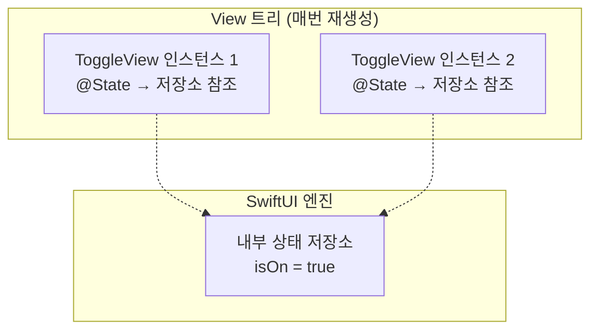
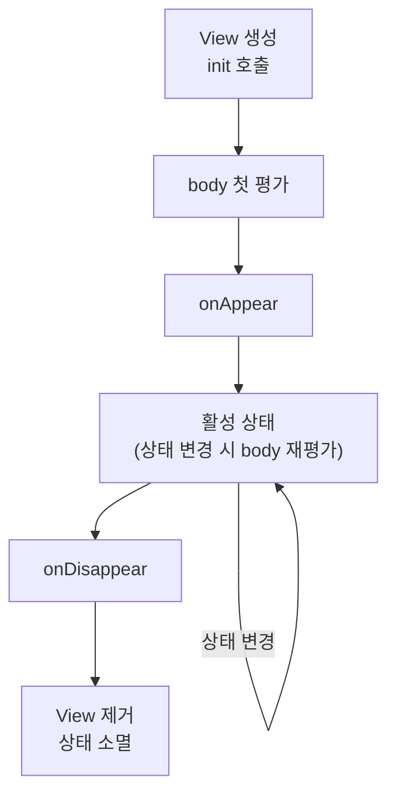

# Chapter 6. SwiftUI 렌더링 엔진의 이해

> SwiftUI의 선언적 UI는 마법처럼 동작하지만, 그 이면에는 정교한 렌더링 엔진이 있습니다. View의 `body`가 언제, 왜 다시 호출되는지, SwiftUI가 어떻게 View를 식별하고 상태를 보존하는지 — 이 메커니즘을 이해하면 성능 문제를 예방하고, 예상치 못한 동작을 디버깅할 수 있습니다.

---

## 6.1 View 프로토콜과 body 호출 시점

### View는 화면이 아니라 설명이다

SwiftUI의 `View`는 UIKit의 `UIView`와 근본적으로 다릅니다. `View`는 **화면에 그려지는 객체가 아니라, 화면을 어떻게 그릴지에 대한 설명(description)**입니다.

```swift
struct CounterView: View {
    @State private var count = 0
    
    var body: some View {
        VStack {
            Text("카운트: \(count)")
            Button("증가") {
                count += 1
            }
        }
    }
}
// CounterView 구조체는 가벼운 값 타입
// body가 반환하는 것도 가벼운 값 타입의 트리
// 실제 렌더링은 SwiftUI 엔진이 담당
```

### body는 언제 호출되는가

SwiftUI는 다음 조건에서 `body`를 다시 호출합니다:

1. **View가 의존하는 상태가 변경될 때** — `@State`, `@Binding`, `@Observable` 등
2. **부모 View가 body를 다시 평가할 때** — 부모로부터 받은 프로퍼티가 변경될 수 있음
3. **Environment 값이 변경될 때** — `@Environment`로 읽은 값이 바뀌면

```swift
struct ParentView: View {
    @State private var name = "SwiftUI"
    @State private var counter = 0
    
    var body: some View {
        let _ = print("ParentView body 호출")
        
        VStack {
            // name이 바뀌면 ChildView의 body도 재호출
            ChildView(name: name)
            
            // counter가 바뀌어도 ChildView의 body는
            // name이 같으면 재호출되지 않음
            // (SwiftUI의 최적화)
            
            Button("카운터: \(counter)") {
                counter += 1
            }
        }
    }
}

struct ChildView: View {
    let name: String
    
    var body: some View {
        let _ = print("ChildView body 호출: \(name)")
        Text("Hello, \(name)")
    }
}
```

> **Note**: `let _ = print(...)` 패턴은 `body`가 호출되는 시점을 디버깅하는 데 유용합니다. 프로덕션 코드에서는 제거하세요.

### View는 struct인데 어떻게 상태를 유지하는가

이것이 SwiftUI의 핵심 질문입니다. View 구조체는 매번 새로 생성되지만, `@State`로 표시된 상태는 **SwiftUI 엔진 내부의 저장소에 별도로 관리**됩니다.

```swift
struct ToggleView: View {
    @State private var isOn = false
    // @State의 초기값은 View가 처음 나타날 때만 사용됨
    // 이후에는 SwiftUI 내부 저장소의 값을 사용
    
    var body: some View {
        Toggle("스위치", isOn: $isOn)
    }
}
```



---

## 6.2 Structural Identity vs Explicit Identity

SwiftUI가 View를 추적하는 방식은 **Identity(정체성)**에 기반합니다. 두 가지 종류가 있습니다.

### Structural Identity — 코드 위치가 정체성

대부분의 SwiftUI View는 **코드 내 위치(structural position)**로 식별됩니다.

```swift
var body: some View {
    VStack {
        Text("첫 번째")   // 위치 0
        Text("두 번째")   // 위치 1
        Text("세 번째")   // 위치 2
    }
}
```

SwiftUI는 "VStack의 0번째 자식", "VStack의 1번째 자식"으로 각 View를 구분합니다. 코드의 **구조적 위치**가 곧 정체성입니다.

### 조건부 View와 Identity 문제

🟡 중급

`if-else`를 사용하면 **서로 다른 Identity**를 가진 View가 됩니다:

```swift
struct ProfileView: View {
    @State private var isEditing = false
    @State private var name = "Swift"
    
    var body: some View {
        VStack {
            if isEditing {
                // Identity A: "if-true 분기의 TextField"
                TextField("이름", text: $name)
                    .textFieldStyle(.roundedBorder)
            } else {
                // Identity B: "if-false 분기의 Text"
                Text(name)
                    .font(.title)
            }
            
            Toggle("편집 모드", isOn: $isEditing)
        }
    }
}
// isEditing이 바뀌면:
// - 이전 View는 완전히 제거 (상태 소멸)
// - 새 View가 생성 (상태 초기화)
// → 트랜지션 애니메이션 발생
```

### Explicit Identity — id()로 직접 지정

`id()` 수정자나 `ForEach`의 id 매개변수로 명시적 정체성을 부여합니다:

```swift
struct AnimatedCounter: View {
    @State private var count = 0
    
    var body: some View {
        VStack {
            // id가 바뀌면 SwiftUI는
            // "새로운 View"로 인식 → 상태 초기화
            Text("\(count)")
                .font(.largeTitle)
                .id(count)  // count가 바뀔 때마다 새 View
                .transition(.push(from: .bottom))
            
            Button("증가") {
                withAnimation {
                    count += 1
                }
            }
        }
    }
}
```

### ForEach와 Identity — 가장 흔한 실수

🟡 중급

```swift
struct Item: Identifiable {
    let id = UUID()
    var name: String
}

struct ItemListView: View {
    @State private var items: [Item] = [
        Item(name: "사과"),
        Item(name: "바나나"),
        Item(name: "체리")
    ]
    
    var body: some View {
        List {
            // ✅ Identifiable 프로토콜의 id 사용
            ForEach(items) { item in
                Text(item.name)
            }
            
            // ❌ 인덱스를 id로 사용하면 안 됨!
            // ForEach(items.indices, id: \.self) { index in
            //     Text(items[index].name)
            // }
            // 아이템 순서가 바뀌면 상태가 꼬임
        }
    }
}
```

인덱스를 `id`로 사용하면, 아이템이 삭제되거나 순서가 바뀔 때 SwiftUI가 **잘못된 View에 상태를 연결**합니다. 항상 고유하고 안정적인 식별자를 사용하세요.

---

## 6.3 View의 생명주기와 상태 보존

### View의 생명주기



```swift
struct LifecycleView: View {
    @State private var data: [String] = []
    
    init() {
        // ⚠️ init은 body가 평가될 때마다 호출될 수 있음
        // 무거운 작업을 여기서 하지 마세요!
        print("init 호출")
    }
    
    var body: some View {
        List(data, id: \.self) { item in
            Text(item)
        }
        .onAppear {
            // View가 화면에 나타날 때
            print("onAppear")
        }
        .onDisappear {
            // View가 화면에서 사라질 때
            print("onDisappear")
        }
        .task {
            // onAppear의 async 버전
            // View가 사라지면 자동 취소
            data = await loadData()
        }
    }
    
    func loadData() async -> [String] {
        try? await Task.sleep(for: .seconds(1))
        return ["항목 1", "항목 2", "항목 3"]
    }
}
```

### 상태 보존과 소멸 규칙

상태가 보존되는 조건:
1. View의 **Identity가 유지**될 때
2. View가 화면에서 **제거되지 않을 때**

```swift
struct TabExample: View {
    @State private var selectedTab = 0
    
    var body: some View {
        TabView(selection: $selectedTab) {
            // 각 탭의 상태는 탭을 전환해도 보존됨
            // (TabView가 내부적으로 모든 탭을 유지)
            CounterView()
                .tabItem { Text("카운터") }
                .tag(0)
            
            SettingsView()
                .tabItem { Text("설정") }
                .tag(1)
        }
    }
}

struct CounterView: View {
    @State private var count = 0
    
    var body: some View {
        Button("카운트: \(count)") { count += 1 }
    }
}

struct SettingsView: View {
    var body: some View { Text("설정") }
}
```

```swift
// 상태가 소멸되는 경우
struct ConditionalView: View {
    @State private var showDetail = false
    
    var body: some View {
        VStack {
            Toggle("상세 보기", isOn: $showDetail)
            
            if showDetail {
                // showDetail이 false가 되면
                // DetailView의 모든 @State가 소멸
                DetailView()
            }
        }
    }
}

struct DetailView: View {
    @State private var text = ""  // 사라졌다 나타나면 초기화됨
    
    var body: some View {
        TextField("입력", text: $text)
    }
}
```

---

## 6.4 디버깅: 왜 body가 다시 호출되는가?

### Self._printChanges() — 공식 디버깅 도구

```swift
struct ProblematicView: View {
    @State private var data: [String] = []
    @Environment(\.colorScheme) var colorScheme
    
    var body: some View {
        // 디버그 빌드에서만 사용
        let _ = Self._printChanges()
        // 출력 예: "ProblematicView: @self, @identity,
        //          _data changed."
        
        List(data, id: \.self) { item in
            Text(item)
        }
    }
}
```

`_printChanges()`의 출력 해석:
- `@self` — View 구조체 자체가 변경됨 (프로퍼티 값이 달라짐)
- `@identity` — View의 Identity가 변경됨 (새 View로 인식)
- `_propertyName` — 특정 상태 프로퍼티가 변경됨

### 불필요한 body 재호출을 방지하는 전략

🟡 중급

**전략 1: View를 작게 분리하기**

```swift
// ❌ 큰 View: counter가 바뀌면 전체 body 재평가
struct BigView: View {
    @State private var counter = 0
    @State private var items: [Item] = []
    
    var body: some View {
        VStack {
            Text("카운터: \(counter)")
            Button("+1") { counter += 1 }
            
            // counter가 바뀔 때마다 이 List도 재평가됨
            ExpensiveListView(items: items)
        }
    }
}

// ✅ View 분리: counter 변경이 List에 영향 없음
struct SmallCounterView: View {
    @State private var counter = 0
    
    var body: some View {
        VStack {
            Text("카운터: \(counter)")
            Button("+1") { counter += 1 }
        }
    }
}

struct ContentView: View {
    @State private var items: [Item] = []
    
    var body: some View {
        VStack {
            SmallCounterView()
            ExpensiveListView(items: items)
        }
    }
}
```

**전략 2: Equatable 활용**

```swift
struct ExpensiveView: View, Equatable {
    let title: String
    let items: [Item]
    
    var body: some View {
        let _ = print("ExpensiveView body 호출")
        VStack {
            Text(title)
            ForEach(items) { item in
                ComplexItemRow(item: item)
            }
        }
    }
    
    // 커스텀 비교: title만 비교하여
    // items가 같은 참조면 body 재호출 방지
    static func == (lhs: Self, rhs: Self) -> Bool {
        lhs.title == rhs.title
            && lhs.items.count == rhs.items.count
    }
}
```

**전략 3: @Observable의 세밀한 추적 활용**

```swift
@Observable
class AppState {
    var userName = "Swift"
    var notificationCount = 0
    var theme = "light"
}

struct HeaderView: View {
    let state: AppState
    
    var body: some View {
        // @Observable은 body에서 실제로 읽은
        // 프로퍼티만 추적함!
        // userName만 읽으므로 notificationCount나
        // theme이 바뀌어도 body가 재호출되지 않음
        Text("Hello, \(state.userName)")
    }
}

struct BadgeView: View {
    let state: AppState
    
    var body: some View {
        // notificationCount만 추적됨
        if state.notificationCount > 0 {
            Image(systemName: "bell.badge")
        }
    }
}
```

이것이 `@Observable`이 `@ObservableObject` + `@Published`보다 성능이 좋은 핵심 이유입니다. `@Published`는 **어떤 프로퍼티가 변경되든** 모든 구독자에게 알리지만, `@Observable`은 **실제로 읽은 프로퍼티가 변경될 때만** 알립니다.

---

## 정리

- **View는 설명이다**: View 구조체는 매번 새로 생성되는 가벼운 값이며, 실제 렌더링은 SwiftUI 엔진이 담당합니다.

- **body 호출 시점**: 의존하는 상태 변경, 부모 View 재평가, Environment 변경 시 호출됩니다.

- **Structural vs Explicit Identity**: 코드 위치가 기본 정체성이고, `id()` 수정자나 `ForEach`의 `id`로 명시할 수 있습니다. `if-else` 분기는 서로 다른 Identity입니다.

- **상태 보존**: Identity가 유지되는 한 `@State`는 보존됩니다. View가 제거되면 상태도 소멸합니다.

- **디버깅**: `Self._printChanges()`로 body가 재호출되는 원인을 추적합니다. View 분리, Equatable, `@Observable`의 세밀한 추적을 활용하여 불필요한 재평가를 줄입니다.

다음 장에서는 **상태 관리**를 본격적으로 다루며, `@State`부터 `@Observable`까지 모든 상태 관리 도구의 올바른 사용법을 마스터합니다.
