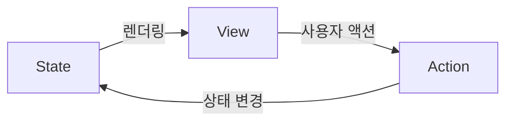

# Chapter 7. 상태 관리 마스터 클래스

> SwiftUI 앱의 품질은 상태 관리 설계에 달려 있습니다. `@State`부터 `@Observable`까지 다양한 도구가 존재하지만, 각각의 용도와 한계를 정확히 이해하지 못하면 혼란과 버그에 빠지기 쉽습니다. 이 장에서는 모든 상태 관리 도구를 체계적으로 정리하고, 실무에서의 올바른 선택 기준을 세웁니다.

---

## 7.1 @State, @Binding, @Environment 깊이 파기

### @State — View가 소유하는 진실의 원천(Source of Truth)

`@State`는 **해당 View가 소유하고 관리하는 상태**입니다. SwiftUI 엔진이 내부 저장소에서 관리하며, View 구조체가 재생성되어도 값이 유지됩니다.

```swift
struct FormView: View {
    // View 로컬 상태 — 이 View에서만 의미 있는 값
    @State private var username = ""
    @State private var password = ""
    @State private var isPasswordVisible = false
    @State private var validationError: String?
    
    var body: some View {
        Form {
            TextField("사용자명", text: $username)
            
            if isPasswordVisible {
                TextField("비밀번호", text: $password)
            } else {
                SecureField("비밀번호", text: $password)
            }
            
            Toggle("비밀번호 보기",
                   isOn: $isPasswordVisible)
            
            if let error = validationError {
                Text(error)
                    .foregroundStyle(.red)
            }
            
            Button("로그인") { validate() }
        }
    }
    
    private func validate() {
        if username.isEmpty {
            validationError = "사용자명을 입력하세요"
        } else if password.count < 8 {
            validationError = "비밀번호는 8자 이상이어야 합니다"
        } else {
            validationError = nil
        }
    }
}
```

**@State 사용 원칙:**
- `private`으로 선언 — 외부에서 직접 접근할 필요 없음
- View 로컬 상태에만 사용 — UI 상태, 폼 입력, 토글 등
- 초기값은 View가 **처음 나타날 때만** 적용됨

> **Warning**: `@State`의 초기값은 View가 처음 나타날 때 단 한 번만 적용됩니다. 부모로부터 전달받은 값으로 `@State`를 초기화하면, 부모의 값이 바뀌어도 자식의 `@State`는 갱신되지 않습니다. 외부 값을 따라가야 한다면 `@State` 초기화 대신 `@Binding`이나 일반 프로퍼티로 받아야 합니다.

### @State와 참조 타입 (iOS 17+)

🟡 중급

iOS 17부터 `@State`에 `@Observable` 객체를 직접 저장할 수 있습니다:

```swift
@Observable
class FormState {
    var username = ""
    var password = ""
    var isValid: Bool {
        !username.isEmpty && password.count >= 8
    }
}

struct ModernFormView: View {
    // @Observable 객체를 @State로 소유
    @State private var formState = FormState()
    
    var body: some View {
        Form {
            TextField("사용자명", text: $formState.username)
            SecureField("비밀번호", text: $formState.password)
            
            Button("로그인") { }
                .disabled(!formState.isValid)
        }
    }
}
```

### @Binding — 진실의 원천에 대한 참조

`@Binding`은 다른 곳에서 관리하는 상태에 대한 **읽기/쓰기 참조**입니다.

```swift
struct RatingView: View {
    @Binding var rating: Int  // 부모가 소유한 상태에 대한 참조
    let maxRating: Int
    
    var body: some View {
        HStack {
            ForEach(1...maxRating, id: \.self) { star in
                Image(systemName: star <= rating
                    ? "star.fill" : "star")
                    .foregroundStyle(.yellow)
                    .onTapGesture { rating = star }
            }
        }
    }
}

struct ReviewView: View {
    @State private var userRating = 0  // 진실의 원천
    
    var body: some View {
        VStack {
            Text("평점을 선택하세요")
            RatingView(rating: $userRating, maxRating: 5)
            Text("선택한 평점: \(userRating)")
        }
    }
}
```

### 커스텀 Binding 만들기

```swift
struct FilterView: View {
    @State private var searchText = ""
    @State private var items = ["Swift", "SwiftUI",
                                 "Kotlin", "Flutter"]
    
    var body: some View {
        VStack {
            // 커스텀 Binding: 입력을 자동으로 소문자로 변환
            TextField("검색", text: Binding(
                get: { searchText },
                set: { searchText = $0.lowercased() }
            ))
            
            // 필터링된 결과
            let filtered = items.filter {
                searchText.isEmpty ||
                $0.lowercased().contains(searchText)
            }
            
            List(filtered, id: \.self) { Text($0) }
        }
    }
}
```

### @Environment — 환경을 통한 값 전달

`@Environment`는 View 계층을 통해 **암묵적으로 전달되는 값**을 읽습니다.

```swift
struct ThemeAwareView: View {
    @Environment(\.colorScheme) var colorScheme
    @Environment(\.dynamicTypeSize) var typeSize
    @Environment(\.horizontalSizeClass) var sizeClass
    
    var body: some View {
        VStack {
            Text("현재 모드: \(colorScheme == .dark ? "다크" : "라이트")")
            Text("글자 크기: \(String(describing: typeSize))")
            
            if sizeClass == .regular {
                // iPad 또는 가로 모드
                HStack { contentViews }
            } else {
                VStack { contentViews }
            }
        }
    }
    
    @ViewBuilder
    var contentViews: some View {
        Text("왼쪽")
        Text("오른쪽")
    }
}
```

### 커스텀 Environment 키

🟡 중급

```swift
// 1. EnvironmentKey 정의
struct AppThemeKey: EnvironmentKey {
    static let defaultValue = AppTheme.standard
}

struct AppTheme {
    var primaryColor: Color
    var cornerRadius: CGFloat
    var spacing: CGFloat
    
    static let standard = AppTheme(
        primaryColor: .blue,
        cornerRadius: 12,
        spacing: 16
    )
    
    static let compact = AppTheme(
        primaryColor: .blue,
        cornerRadius: 8,
        spacing: 8
    )
}

// 2. EnvironmentValues 확장
extension EnvironmentValues {
    var appTheme: AppTheme {
        get { self[AppThemeKey.self] }
        set { self[AppThemeKey.self] = newValue }
    }
}

// 3. 사용
struct ThemedButton: View {
    @Environment(\.appTheme) var theme
    let title: String
    let action: () -> Void
    
    var body: some View {
        Button(action: action) {
            Text(title)
                .padding(theme.spacing)
                .background(theme.primaryColor)
                .clipShape(RoundedRectangle(
                    cornerRadius: theme.cornerRadius))
        }
    }
}

// 4. 주입
struct ContentView: View {
    var body: some View {
        NavigationStack {
            MainView()
        }
        .environment(\.appTheme, .compact)
    }
}
```

> **Tip**: Xcode 16(iOS 18 SDK)부터는 `@Entry` 매크로로 위 1~2단계(`EnvironmentKey` 정의 + `EnvironmentValues` 확장)를 한 줄로 줄일 수 있습니다.
>
> ```swift
> extension EnvironmentValues {
>     @Entry var appTheme: AppTheme = .standard
> }
> ```
>
> 디플로이먼트 타깃이 그보다 낮다면 위의 `EnvironmentKey` 방식을 그대로 사용해야 합니다.

---

## 7.2 @Observable vs @ObservableObject — 마이그레이션 전략

### @ObservableObject의 한계

```swift
// 기존 방식: @ObservableObject + @Published
class UserSettings: ObservableObject {
    @Published var theme: String = "light"
    @Published var fontSize: Int = 16
    @Published var notifications: Bool = true
}

struct SettingsView: View {
    @ObservedObject var settings: UserSettings
    
    var body: some View {
        // ⚠️ 문제: theme만 표시하지만
        // fontSize나 notifications가 바뀌어도
        // body가 재호출됨!
        Text("테마: \(settings.theme)")
    }
}
```

### @Observable의 장점

```swift
// 새로운 방식: @Observable
@Observable
class UserSettings {
    var theme: String = "light"
    var fontSize: Int = 16
    var notifications: Bool = true
    // @Published 필요 없음!
}

struct SettingsView: View {
    var settings: UserSettings
    // @ObservedObject 필요 없음!
    
    var body: some View {
        // ✅ theme만 읽으므로
        // fontSize나 notifications가 바뀌어도
        // body가 재호출되지 않음
        Text("테마: \(settings.theme)")
    }
}
```

### 마이그레이션 비교표

| 기존 (`ObservableObject`) | 새로운 (`@Observable`) |
|--------------------------|----------------------|
| `class Foo: ObservableObject` | `@Observable class Foo` |
| `@Published var prop` | `var prop` (자동 추적) |
| `@ObservedObject var foo` | `var foo` (일반 프로퍼티) |
| `@StateObject var foo` | `@State var foo` |
| `@EnvironmentObject var foo` | `@Environment(Foo.self) var foo` |
| `.environmentObject(foo)` | `.environment(foo)` |

### 마이그레이션 실전

🟡 중급

```swift
// Before
class AppState: ObservableObject {
    @Published var user: User?
    @Published var isAuthenticated = false
    @Published var cart = ShoppingCart()
}

struct RootView: View {
    @StateObject private var state = AppState()
    
    var body: some View {
        ContentView()
            .environmentObject(state)
    }
}

struct CartView: View {
    @EnvironmentObject var state: AppState
    
    var body: some View {
        Text("장바구니: \(state.cart.itemCount)개")
    }
}
```

```swift
// After
@Observable
class AppState {
    var user: User?
    var isAuthenticated = false
    var cart = ShoppingCart()
}

struct RootView: View {
    @State private var state = AppState()
    
    var body: some View {
        ContentView()
            .environment(state)
    }
}

struct CartView: View {
    @Environment(AppState.self) var state
    
    var body: some View {
        Text("장바구니: \(state.cart.itemCount)개")
    }
}
```

> **Warning**: `@Observable`은 iOS 17+ / macOS 14+부터 사용 가능합니다. 이전 버전을 지원해야 한다면 `@ObservableObject`를 계속 사용하거나, `swift-perception` 패키지를 고려하세요.

### @Bindable — @Observable 시대의 바인딩

`@Observable` 객체의 프로퍼티에 `$` 바인딩을 생성하려면 `@Bindable`이 필요합니다.

> **Warning**: `@Bindable` 누락은 `@ObservableObject`에서 `@Observable`로 마이그레이션할 때 가장 놓치기 쉬운 부분입니다. 일반 프로퍼티나 `@Environment`로 받은 `@Observable` 객체에는 `$` 프로젝션이 없으므로, `$editor.name` 같은 바인딩을 쓰려면 반드시 `@Bindable`로 감싸야 합니다.

```swift
@Observable
class ProfileEditor {
    var name = ""
    var bio = ""
    var isPublic = true
}

struct ProfileEditView: View {
    // @Bindable로 감싸야 $editor.name 바인딩 가능
    @Bindable var editor: ProfileEditor
    
    var body: some View {
        Form {
            TextField("이름", text: $editor.name)
            TextField("소개", text: $editor.bio)
            Toggle("공개", isOn: $editor.isPublic)
        }
    }
}

// @State로 소유할 때는 @Bindable 불필요
// @State가 자동으로 Bindable 역할을 함
struct ProfileView: View {
    @State private var editor = ProfileEditor()
    
    var body: some View {
        // @State가 객체를 소유하므로 자식에 그대로 전달.
        // 여기서 직접 바인딩이 필요하면 $editor.name도 사용 가능
        ProfileEditView(editor: editor)
    }
}

// @Environment에서 바인딩이 필요할 때
struct SettingsView: View {
    @Environment(AppSettings.self) var settings
    
    var body: some View {
        // @Bindable을 로컬에서 생성
        @Bindable var settings = settings
        Toggle("다크 모드", isOn: $settings.isDarkMode)
    }
}
```

**@Bindable이 필요한 경우:**
- `@Observable` 객체를 일반 프로퍼티(`var`)로 받을 때
- `@Environment`로 받은 `@Observable` 객체에 바인딩할 때

**@Bindable이 불필요한 경우:**
- `@State`로 소유한 `@Observable` 객체 → `@State`가 자동 처리

### @ObservationIgnored — 추적 대상에서 제외

`@Observable` 클래스의 특정 프로퍼티를 변경 추적에서 제외하려면 `@ObservationIgnored`를 사용합니다:

```swift
@Observable
@MainActor   // UndoManager() 기본값이 MainActor 격리이므로 함께 격리
class DocumentEditor {
    var title = ""        // 변경 시 View 업데이트
    var content = ""      // 변경 시 View 업데이트
    
    @ObservationIgnored
    var undoManager = UndoManager()  // View 업데이트 불필요
    
    @ObservationIgnored
    var lastSavedAt: Date?  // 내부 상태, UI에 직접 노출 안 함
    
    @ObservationIgnored
    private var debounceTask: Task<Void, Never>?
}
```

> **Note**: `UndoManager()`의 기본값은 `@MainActor`에 격리되어 있습니다. Swift 6 언어 모드의 완전 동시성 검사에서는 nonisolated 컨텍스트에서 이 기본값을 쓰면 컴파일 에러가 납니다. `@Observable` ViewModel은 대개 UI와 함께 동작하므로 클래스에 `@MainActor`를 붙이는 것이 가장 안전합니다.

`@ObservationIgnored`가 유용한 경우:
- **내부 관리용 프로퍼티**: `UndoManager`, `Task`, 캐시 등
- **성능 최적화**: 매우 빈번하게 변경되지만 UI에 반영할 필요 없는 값
- **약한 참조 프로퍼티와 함께**: `@ObservationIgnored weak var delegate: ...`처럼 delegate를 둘 때

> **Warning**: `@ObservationIgnored`는 **Observation 추적에서 제외**할 뿐, ARC 동작(strong/weak)에는 아무런 영향이 없습니다. 이 속성만으로는 순환 참조가 방지되지 않습니다. 순환 참조는 `weak`/`unowned`로만 끊을 수 있으며, 추적이 불필요한 약한 참조라면 `@ObservationIgnored weak var delegate`처럼 둘을 함께 사용합니다.

---

## 7.3 단방향 데이터 흐름 설계

### 왜 단방향인가

양방향 데이터 흐름은 상태 변경의 원인을 추적하기 어렵게 만듭니다. 단방향 데이터 흐름은 **상태 → View → 액션 → 상태** 순환을 강제하여 예측 가능성을 높입니다.



### 실전 패턴: ViewModel과 단방향 흐름

🟡 중급

```swift
// 액션 정의
enum TodoAction {
    case updateText(String)   // 텍스트 입력도 액션으로 처리
    case add(String)
    case toggle(UUID)
    case delete(UUID)
    case clearCompleted
}

// 상태 정의
struct TodoState {
    var items: [TodoItem] = []
    var newItemText = ""
    
    var activeCount: Int {
        items.filter { !$0.isCompleted }.count
    }
}

struct TodoItem: Identifiable {
    let id = UUID()
    var title: String
    var isCompleted = false
}

// ViewModel: 상태 + 액션 처리
@Observable
class TodoViewModel {
    private(set) var state = TodoState()
    
    func send(_ action: TodoAction) {
        switch action {
        case .updateText(let text):
            // 입력 변경도 ViewModel을 거치게 해 단방향 흐름 유지
            state.newItemText = text
            
        case .add(let title):
            guard !title.isEmpty else { return }
            state.items.append(TodoItem(title: title))
            state.newItemText = ""
            
        case .toggle(let id):
            guard let index = state.items.firstIndex(
                where: { $0.id == id }
            ) else { return }
            state.items[index].isCompleted.toggle()
            
        case .delete(let id):
            state.items.removeAll { $0.id == id }
            
        case .clearCompleted:
            state.items.removeAll { $0.isCompleted }
        }
    }
}

// View: 상태를 읽고 액션을 보냄
struct TodoView: View {
    @State private var viewModel = TodoViewModel()
    
    var body: some View {
        NavigationStack {
            List {
                ForEach(viewModel.state.items) { item in
                    HStack {
                        Image(systemName: item.isCompleted
                            ? "checkmark.circle.fill"
                            : "circle")
                            .onTapGesture {
                                viewModel.send(.toggle(item.id))
                            }
                        Text(item.title)
                            .strikethrough(item.isCompleted)
                    }
                }
                .onDelete { indexSet in
                    for index in indexSet {
                        let id = viewModel.state.items[index].id
                        viewModel.send(.delete(id))
                    }
                }
            }
            .navigationTitle(
                "할 일 (\(viewModel.state.activeCount))"
            )
            .toolbar {
                Button("완료 항목 삭제") {
                    viewModel.send(.clearCompleted)
                }
            }
            .safeAreaInset(edge: .bottom) {
                HStack {
                    // private(set) 캡슐화를 지키면서, 입력도
                    // send(_:)를 통해서만 상태를 바꾼다.
                    TextField(
                        "새 할 일",
                        text: Binding(
                            get: { viewModel.state.newItemText },
                            set: { viewModel.send(.updateText($0)) }
                        )
                    )
                    Button("추가") {
                        viewModel.send(
                            .add(viewModel.state.newItemText)
                        )
                    }
                }
                .padding()
            }
        }
    }
}
```

> **Note**: `state`를 `private(set)`으로 막아 두었기 때문에 View는 `state`를 직접 쓸 수 없습니다. 그래서 텍스트 입력처럼 사소해 보이는 변경도 `send(.updateText($0))`로 보냅니다. 모든 상태 변경이 `send(_:)` 한 곳을 거치므로 변경 지점을 추적하기 쉽고, 단방향 흐름이 깨지지 않습니다.

---

## 7.4 상태 공유 패턴과 의존성 주입

여러 View가 같은 상태나 서비스를 공유해야 할 때, 의존성 주입(Dependency Injection, DI)을 쓰면 객체의 생성과 사용을 분리해 테스트 가능한 구조를 만들 수 있습니다. SwiftUI에서는 `@Environment`가 그 통로 역할을 합니다.

### 패턴 1: Environment를 통한 공유

```swift
@Observable
class AuthService {
    var currentUser: User?
    var isAuthenticated: Bool { currentUser != nil }
    
    func signIn(email: String, password: String) async throws {
        // 인증 로직
    }
    
    func signOut() {
        currentUser = nil
    }
}

// 앱 루트에서 주입
@main
struct MyApp: App {
    @State private var authService = AuthService()
    
    var body: some Scene {
        WindowGroup {
            RootView()
                .environment(authService)
        }
    }
}

// 어디서든 사용
struct ProfileView: View {
    @Environment(AuthService.self) var auth
    
    var body: some View {
        if let user = auth.currentUser {
            Text("환영합니다, \(user.name)님")
            Button("로그아웃") { auth.signOut() }
        }
    }
}
```

### 패턴 2: 의존성 주입 컨테이너

🔴 고급

```swift
@Observable
class DependencyContainer {
    let networkClient: NetworkClient
    let authService: AuthService
    let analyticsService: AnalyticsService
    
    init(
        networkClient: NetworkClient = .live,
        authService: AuthService = .live,
        analyticsService: AnalyticsService = .live
    ) {
        self.networkClient = networkClient
        self.authService = authService
        self.analyticsService = analyticsService
    }
    
    // 테스트용 팩토리
    static var preview: DependencyContainer {
        DependencyContainer(
            networkClient: .mock,
            authService: .mock,
            analyticsService: .noop
        )
    }
}

// Environment를 통해 전체 앱에 주입
struct AppView: View {
    @State private var deps = DependencyContainer()
    
    var body: some View {
        ContentView()
            .environment(deps)
    }
}

// Preview에서는 mock 주입
#Preview {
    ContentView()
        .environment(DependencyContainer.preview)
}
```

---

## 정리

- **@State**: View 로컬 상태. `private`으로 선언하며, iOS 17+에서는 `@Observable` 객체도 저장 가능합니다.

- **@Binding**: 부모의 상태에 대한 읽기/쓰기 참조. 커스텀 Binding으로 값 변환도 가능합니다.

- **@Environment**: View 계층을 통한 암묵적 값 전달. 커스텀 Environment 키로 앱 전용 값을 정의할 수 있습니다.

- **@Observable vs @ObservableObject**: `@Observable`은 프로퍼티 단위의 세밀한 추적으로 성능이 우수합니다. iOS 17+에서 마이그레이션을 권장합니다.

- **단방향 데이터 흐름**: State → View → Action → State 순환으로 예측 가능한 상태 관리를 구현합니다.

- **의존성 주입**: Environment를 활용한 DI 컨테이너 패턴으로 테스트 가능한 구조를 만듭니다.

다음 장에서는 **커스텀 레이아웃과 그래픽**을 다루며, Layout 프로토콜과 Canvas를 활용한 고급 UI를 구현합니다.
