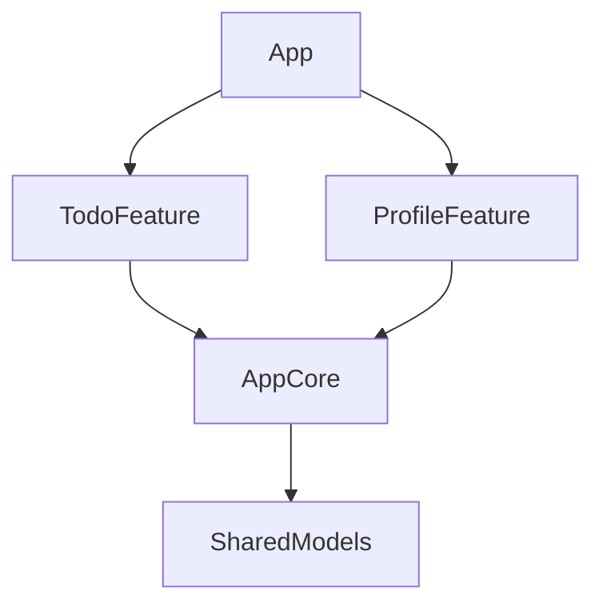

# Chapter 11. SwiftUI 앱 아키텍처

> "SwiftUI에서 MVVM을 쓰는 게 맞나요?" — 가장 많이 받는 질문입니다. SwiftUI는 이미 View와 상태의 바인딩을 내장하고 있어 전통적인 MVVM의 역할이 줄었습니다. 이 장에서는 SwiftUI에 맞는 아키텍처 패턴을 탐구하고, TCA(The Composable Architecture)를 소개하며, 모듈화와 테스트 가능한 설계를 다룹니다.

---

## 11.1 MVVM을 넘어서: SwiftUI에 맞는 아키텍처

### SwiftUI에서 ViewModel이 꼭 필요한가?

```swift
// UIKit 시절: ViewModel이 필수였던 이유
// - View는 수동으로 업데이트해야 함
// - 데이터 바인딩이 없음
// - 테스트를 위해 View 로직 분리 필요

// SwiftUI: View 자체가 이미 선언적
struct SimpleView: View {
    // ViewModel 없이도 충분한 경우
    @State private var items: [Item] = []
    @State private var isLoading = false
    
    var body: some View {
        List(items) { item in Text(item.name) }
            .overlay {
                if isLoading { ProgressView() }
            }
            .task {
                isLoading = true
                items = await ItemService.fetchAll()
                isLoading = false
            }
    }
}
```

### 아키텍처가 필요한 시점

단순한 화면에서는 `@State` + `.task`로 충분합니다. 하지만 다음 조건이 생기면 아키텍처가 필요합니다:

1. **비즈니스 로직이 복잡** — 유효성 검사, 상태 전이, 조건부 로직
2. **여러 화면이 상태를 공유** — 장바구니, 인증 상태
3. **테스트가 필요** — View 로직을 분리해야 단위 테스트 가능
4. **부수 효과(Side Effect) 관리** — 네트워크, 로컬 DB, 알림

### 패턴 비교

| 패턴 | 장점 | 단점 | 적합한 상황 |
|------|------|------|-------------|
| View + @State | 간단, 보일러플레이트 없음 | 테스트 어려움 | 단순한 화면 |
| @Observable ViewModel | 익숙함, 로직 분리 | 과도한 추상화 위험 | 중간 복잡도 |
| 단방향 흐름 (Redux-like) | 예측 가능, 디버깅 용이 | 보일러플레이트 | 복잡한 상태 전이 |
| TCA | 합성 가능, 테스트 우수 | 학습 곡선 높음 | 대규모 앱 |

---

## 11.2 @Observable ViewModel 패턴

🟡 중급

```swift
// 도메인 모델
struct Article: Identifiable, Sendable {
    let id: UUID
    var title: String
    var body: String
    var isBookmarked: Bool
    var publishedAt: Date
}

// ViewModel: 비즈니스 로직 담당
// @MainActor를 부여해 async 메서드 재개 이후의 상태 변경이
// 메인 액터에서 일어나도록 보장한다.
@MainActor
@Observable
final class ArticleListViewModel {
    private(set) var articles: [Article] = []
    private(set) var isLoading = false
    private(set) var error: Error?
    var searchQuery = ""
    
    var filteredArticles: [Article] {
        guard !searchQuery.isEmpty else { return articles }
        return articles.filter {
            $0.title.localizedCaseInsensitiveContains(
                searchQuery)
        }
    }
    
    private let repository: ArticleRepository
    
    init(repository: ArticleRepository) {
        self.repository = repository
    }
    
    func loadArticles() async {
        isLoading = true
        error = nil
        defer { isLoading = false }
        
        do {
            articles = try await repository.fetchAll()
        } catch {
            self.error = error
        }
    }
    
    func toggleBookmark(_ article: Article) async {
        guard let index = articles.firstIndex(
            where: { $0.id == article.id })
        else { return }
        
        articles[index].isBookmarked.toggle()
        
        do {
            try await repository.update(articles[index])
        } catch {
            // 롤백
            articles[index].isBookmarked.toggle()
            self.error = error
        }
    }
}

// View: 표시와 사용자 상호작용만 담당
struct ArticleListView: View {
    @State private var viewModel: ArticleListViewModel
    
    init(repository: ArticleRepository) {
        _viewModel = State(initialValue:
            ArticleListViewModel(repository: repository))
    }
    
    var body: some View {
        List(viewModel.filteredArticles) { article in
            ArticleRow(article: article) {
                Task {
                    await viewModel.toggleBookmark(article)
                }
            }
        }
        .searchable(text: $viewModel.searchQuery)
        .overlay {
            if viewModel.isLoading { ProgressView() }
        }
        .task { await viewModel.loadArticles() }
    }
}
```

> **Note**: `@Observable` ViewModel에는 `@MainActor`를 붙이는 것을 표준으로 삼으세요. SE-0338 이후 `nonisolated`한 async 메서드는 호출자의 액터를 상속하지 않고 전역 실행기에서 재개됩니다. 따라서 `@MainActor`가 없으면 `await repository.fetchAll()` 재개 이후의 `articles = ...` 같은 상태 변경이 메인 액터 밖에서 일어납니다. SwiftUI는 이 상태를 메인에서 관찰하므로 데이터 경합 위험이 생기는데, 컴파일러가 막아 주지 않아 더 위험합니다.

---

## 11.3 The Composable Architecture(TCA) 소개

🔴 고급

TCA는 Point-Free에서 만든 Swift 아키텍처 프레임워크로, **합성 가능한(Composable)** 설계를 핵심으로 합니다.

### TCA의 핵심 개념

```swift
import ComposableArchitecture

@Reducer
struct CounterFeature {
    // 1. State: 화면의 모든 상태
    @ObservableState
    struct State: Equatable {
        var count = 0
        var isTimerRunning = false
    }
    
    // 2. Action: 발생할 수 있는 모든 이벤트
    enum Action {
        case incrementButtonTapped
        case decrementButtonTapped
        case timerTick
        case toggleTimerButtonTapped
    }
    
    // 시간 의존성을 주입받는다. 테스트에서는 TestClock으로 교체해
    // 실제 시간을 기다리지 않고 제어할 수 있다.
    @Dependency(\.continuousClock) var clock
    
    // 3. Reducer: Action을 받아 State를 변경하고
    //    필요시 Effect를 반환
    var body: some ReducerOf<Self> {
        Reduce { state, action in
            switch action {
            case .incrementButtonTapped:
                state.count += 1
                return .none
                
            case .decrementButtonTapped:
                state.count -= 1
                return .none
                
            case .toggleTimerButtonTapped:
                state.isTimerRunning.toggle()
                if state.isTimerRunning {
                    // Task.sleep이 아니라 주입된 clock의 timer를
                    // 사용해야 TestClock으로 시간을 제어할 수 있다.
                    return .run { send in
                        for await _ in self.clock.timer(
                            interval: .seconds(1)) {
                            await send(.timerTick)
                        }
                    }
                    .cancellable(id: CancelID.timer)
                } else {
                    return .cancel(id: CancelID.timer)
                }
                
            case .timerTick:
                state.count += 1
                return .none
            }
        }
    }
    
    enum CancelID { case timer }
}

// 4. View: Store를 통해 상태를 읽고 액션을 보냄
struct CounterView: View {
    let store: StoreOf<CounterFeature>
    
    var body: some View {
        VStack {
            Text("\(store.count)")
                .font(.largeTitle)
            
            HStack {
                Button("-") {
                    store.send(.decrementButtonTapped)
                }
                Button("+") {
                    store.send(.incrementButtonTapped)
                }
            }
            
            Button(store.isTimerRunning
                   ? "타이머 중지" : "타이머 시작") {
                store.send(.toggleTimerButtonTapped)
            }
        }
    }
}
```

타이머 Effect가 `Task.sleep` 대신 `@Dependency(\.continuousClock)`로 주입받은 `clock`을 사용하는 점에 주목하세요. `Task.sleep`은 시스템 연속 클럭을 직접 사용하므로 테스트에서 시간을 제어할 수 없지만, 주입된 `clock`을 통하면 11.6에서 보듯 `TestClock`으로 교체해 시간을 즉시 앞당길 수 있습니다.

### TCA의 장점

- **테스트**: `TestStore`로 상태 변화와 부수 효과를 검증
- **합성**: 작은 Feature를 조합하여 큰 Feature 구성
- **부수 효과 관리**: Effect 시스템으로 비동기 작업을 체계적으로 관리
- **의존성 주입**: `@Dependency`로 외부 의존성을 주입

---

## 11.4 모듈화와 의존성 관리

### Swift Package 기반 모듈화

```text
MyApp/
├── App/                    # 앱 타겟
├── Packages/
│   ├── Core/               # 공통 유틸리티, 모델
│   ├── Networking/          # 네트워크 클라이언트
│   ├── Features/
│   │   ├── Home/           # 홈 화면 Feature
│   │   ├── Search/         # 검색 Feature
│   │   └── Profile/        # 프로필 Feature
│   └── DesignSystem/       # 공통 UI 컴포넌트
```

### 프로토콜 기반 의존성 역전

여기서 `Article`은 `Core`(예: `SharedModels`) 모듈의 `public` 타입이라고 가정합니다. `public` API에 노출되는 도메인 모델은 모듈 경계를 넘기 위해 `public`이어야 합니다.

```swift
// Core 모듈: 인터페이스 정의
public protocol ArticleRepository: Sendable {
    func fetchAll() async throws -> [Article]
    func update(_ article: Article) async throws
}

// Networking 모듈: 구현
public struct LiveArticleRepository: ArticleRepository {
    public func fetchAll() async throws -> [Article] {
        // 실제 네트워크 호출
        []
    }
    public func update(_ article: Article) async throws {
        // 실제 API 호출
    }
}

// 테스트: Mock 구현
struct MockArticleRepository: ArticleRepository {
    var articles: [Article] = []
    
    func fetchAll() async throws -> [Article] {
        articles
    }
    func update(_ article: Article) async throws { }
}
```

---

## 11.5 TCA Feature 합성 — Scope와 부모-자식 관계

🔴 고급

TCA의 가장 강력한 특성은 **합성(Composition)**입니다. 작은 Feature를 독립적으로 만든 뒤, 부모 Feature에서 조합하면 각 Feature는 자신의 State와 Action만 알면 됩니다. 이 절에서는 `TodoListFeature`가 여러 개의 `TodoItemFeature`를 품는 부모-자식 관계를 구현합니다.

### 자식 Feature — TodoItemFeature

먼저 할 일 하나를 담당하는 자식 Feature를 정의합니다.

```swift
import ComposableArchitecture

@Reducer
struct TodoItemFeature {
    @ObservableState
    struct State: Equatable, Identifiable {
        let id: UUID
        var title: String
        var isCompleted: Bool = false
        var isEditing: Bool = false
    }
    
    enum Action: Equatable {
        case toggleCompleted
        case editButtonTapped
        case titleChanged(String)
        case editDone
    }
    
    var body: some ReducerOf<Self> {
        Reduce { state, action in
            switch action {
            case .toggleCompleted:
                state.isCompleted.toggle()
                return .none
                
            case .editButtonTapped:
                state.isEditing = true
                return .none
                
            case let .titleChanged(newTitle):
                state.title = newTitle
                return .none
                
            case .editDone:
                state.isEditing = false
                // 빈 제목이면 기본값으로 복원
                if state.title.trimmingCharacters(
                    in: .whitespaces).isEmpty {
                    state.title = "제목 없음"
                }
                return .none
            }
        }
    }
}

struct TodoItemView: View {
    let store: StoreOf<TodoItemFeature>
    
    var body: some View {
        HStack {
            Button {
                store.send(.toggleCompleted)
            } label: {
                Image(systemName: store.isCompleted
                      ? "checkmark.circle.fill"
                      : "circle")
            }
            
            if store.isEditing {
                TextField(
                    "할 일",
                    text: Binding(
                        get: { store.title },
                        set: { store.send(.titleChanged($0)) }
                    )
                )
                .onSubmit { store.send(.editDone) }
            } else {
                Text(store.title)
                    .strikethrough(store.isCompleted)
                Spacer()
                Button("편집") {
                    store.send(.editButtonTapped)
                }
            }
        }
    }
}
```

`TodoItemFeature`는 오직 **하나의 할 일 항목**에 대한 상태와 액션만 관리합니다. 리스트에 대해서는 전혀 모릅니다.

### 부모 Feature — TodoListFeature

부모 Feature는 자식 Feature의 배열을 `IdentifiedArray`로 관리하고, `forEach`를 사용해 각 항목의 리듀서를 자동으로 연결합니다.

```swift
@Reducer
struct TodoListFeature {
    @ObservableState
    struct State: Equatable {
        var items: IdentifiedArrayOf<TodoItemFeature.State> = []
        var newItemTitle: String = ""
        var filter: Filter = .all
        var isLoading = false
        
        var filteredItems: IdentifiedArrayOf<
            TodoItemFeature.State
        > {
            switch filter {
            case .all:
                return items
            case .active:
                return items.filter { !$0.isCompleted }
            case .completed:
                return items.filter { $0.isCompleted }
            }
        }
        
        enum Filter: String, CaseIterable {
            case all = "전체"
            case active = "진행 중"
            case completed = "완료"
        }
    }
    
    enum Action {
        // 부모 자체 액션
        case addButtonTapped
        case newItemTitleChanged(String)
        case deleteItems(ids: [TodoItemFeature.State.ID])
        case filterChanged(State.Filter)
        case clearCompletedTapped
        // 비동기 로딩 (11.6에서 테스트)
        case loadButtonTapped
        case loadResponse(Result<[TodoItemFeature.State], Error>)
        // 자식 액션 위임
        case items(IdentifiedActionOf<TodoItemFeature>)
    }
    
    @Dependency(\.uuid) var uuid
    // todoClient의 정의는 11.6에서 다룹니다.
    @Dependency(\.todoClient) var todoClient
    
    var body: some ReducerOf<Self> {
        Reduce { state, action in
            switch action {
            case .addButtonTapped:
                let title = state.newItemTitle
                    .trimmingCharacters(in: .whitespaces)
                guard !title.isEmpty else { return .none }
                state.items.append(
                    TodoItemFeature.State(
                        id: uuid(), title: title)
                )
                state.newItemTitle = ""
                return .none
                
            case let .newItemTitleChanged(title):
                state.newItemTitle = title
                return .none
                
            case let .deleteItems(ids):
                // 오프셋이 아니라 ID로 삭제한다. 필터가 적용되면
                // 화면의 인덱스와 전체 items의 인덱스가 어긋나므로
                // ID 기반 삭제가 안전하다.
                for id in ids {
                    state.items.remove(id: id)
                }
                return .none
                
            case let .filterChanged(filter):
                state.filter = filter
                return .none
                
            case .clearCompletedTapped:
                state.items.removeAll { $0.isCompleted }
                return .none
                
            case .loadButtonTapped:
                state.isLoading = true
                return .run { send in
                    // Result(catching:)는 동기 클로저만 받으므로
                    // 비동기 호출은 do/catch로 직접 감싼다.
                    do {
                        let items = try await todoClient
                            .fetchAll()
                        await send(.loadResponse(
                            .success(items)))
                    } catch {
                        await send(.loadResponse(
                            .failure(error)))
                    }
                }
                
            case let .loadResponse(.success(items)):
                state.isLoading = false
                state.items = IdentifiedArray(
                    uniqueElements: items)
                return .none
                
            case .loadResponse(.failure):
                state.isLoading = false
                return .none
                
            case .items:
                // 자식 액션은 forEach에서 처리
                return .none
            }
        }
        .forEach(\.items, action: \.items) {
            TodoItemFeature()
        }
    }
}
```

핵심은 `.forEach(\.items, action: \.items)` 한 줄입니다. 이 코드가 하는 일은 다음과 같습니다:

1. `items` 배열의 각 요소를 `TodoItemFeature` 리듀서에 연결합니다.
2. 자식 액션이 올라오면 해당 ID의 항목에만 리듀서를 실행합니다.
3. 부모 리듀서에서 `.items` 케이스로 자식 액션을 관찰할 수 있습니다.

이 Feature에는 11.6의 테스트에서 사용할 비동기 로딩 기능도 포함했습니다. `loadButtonTapped`/`loadResponse` 액션과 `isLoading` 상태, 그리고 `todoClient` 의존성으로 서버에서 할 일을 불러옵니다(`todoClient`의 정의는 11.6에서 다룹니다).

> **Note**: `Action`에서 `Equatable` 준수를 뺀 점에 주목하세요. `loadResponse(Result<[TodoItemFeature.State], Error>)`의 `Error`는 `Equatable`이 아니므로 `Action` 전체를 `Equatable`로 만들 수 없습니다. TCA 1.x의 `TestStore`는 `Action`의 `Equatable`이 아니라 케이스 키패스(`receive(\.loadResponse.success)`)로 동작하므로, `Action`에 `Equatable`은 필요하지 않습니다.

### 부모 View — TodoListView

```swift
struct TodoListView: View {
    let store: StoreOf<TodoListFeature>
    
    var body: some View {
        NavigationStack {
            VStack {
                // 필터 피커
                Picker(
                    "필터",
                    selection: Binding(
                        get: { store.filter },
                        set: {
                            store.send(.filterChanged($0))
                        }
                    )
                ) {
                    ForEach(
                        TodoListFeature.State.Filter
                            .allCases,
                        id: \.self
                    ) { filter in
                        Text(filter.rawValue)
                            .tag(filter)
                    }
                }
                .pickerStyle(.segmented)
                .padding(.horizontal)
                
                // 할 일 목록
                List {
                    ForEach(
                        store.scope(
                            state: \.filteredItems,
                            action: \.items)
                    ) { itemStore in
                        TodoItemView(store: itemStore)
                    }
                    .onDelete { indexSet in
                        // 화면에 보이는 filteredItems의 오프셋을
                        // ID로 변환해 보낸다. 필터가 걸린 상태에서도
                        // 정확한 항목이 삭제된다.
                        let ids = indexSet.map {
                            store.filteredItems[$0].id
                        }
                        store.send(.deleteItems(ids: ids))
                    }
                }
                
                // 새 항목 추가
                HStack {
                    TextField(
                        "새 할 일",
                        text: Binding(
                            get: { store.newItemTitle },
                            set: {
                                store.send(
                                    .newItemTitleChanged($0))
                            }
                        )
                    )
                    .textFieldStyle(.roundedBorder)
                    
                    Button("추가") {
                        store.send(.addButtonTapped)
                    }
                    .disabled(
                        store.newItemTitle
                            .trimmingCharacters(
                                in: .whitespaces)
                            .isEmpty
                    )
                }
                .padding()
            }
            .navigationTitle("할 일 목록")
            .toolbar {
                Button("완료 항목 삭제") {
                    store.send(.clearCompletedTapped)
                }
            }
        }
    }
}
```

`store.scope(state:action:)`는 부모 Store에서 자식 Store를 파생(derive)합니다. View 계층과 Feature 계층이 1:1로 대응하므로 각 View는 자신이 필요한 상태만 바라보게 됩니다.

> **Note**: 여기서는 저장 프로퍼티 `items`가 아니라 **계산 프로퍼티** `filteredItems`에 스코프를 걸었습니다. 이는 표준형(`\.items`에 스코프)이 아닌 파생 컬렉션 스코프로, 액션이 요소 ID로 라우팅되므로 표시는 정상 동작합니다. 다만 삭제 같은 위치 기반 조작은 반드시 ID로 변환해야 안전합니다(위 `onDelete` 참고). 필터링이 복잡하지 않다면 `\.items`에 스코프한 뒤 View 단계에서 거르는 표준형이 더 단순합니다.

### 합성의 이점

| 관점 | 설명 |
|------|------|
| 독립 개발 | `TodoItemFeature`만 별도로 빌드하고 테스트할 수 있습니다 |
| 재사용 | 같은 자식 Feature를 다른 부모에서 재사용할 수 있습니다 |
| 스코프 격리 | 자식은 부모 상태를 알지 못하므로 결합도가 낮습니다 |
| 점진적 확장 | 새 자식 Feature를 추가해도 기존 코드 변경이 최소화됩니다 |

---

## 11.6 TCA 테스트 — TestStore 활용

🔴 고급

TCA의 최대 장점 중 하나는 **테스트 용이성**입니다. `TestStore`를 사용하면 "액션을 보내고, 상태가 예상대로 변했는지 한 줄씩 검증"하는 방식으로 테스트를 작성합니다. 별도의 UI 테스트 없이도 비즈니스 로직 전체를 커버할 수 있습니다.

### TestStore 기본 사용법

```swift
import ComposableArchitecture
import Testing

@Suite("TodoItemFeature Tests")
struct TodoItemFeatureTests {
    @Test("완료 토글이 상태를 올바르게 변경합니다")
    func toggleCompleted() async {
        let store = TestStore(
            initialState: TodoItemFeature.State(
                id: UUID(0), title: "우유 사기")
        ) {
            TodoItemFeature()
        }
        
        // send: 액션을 보내고, 변경된 상태를 검증
        await store.send(.toggleCompleted) {
            // 클로저 안에서 expected state를 설정
            $0.isCompleted = true
        }
        
        // 다시 토글
        await store.send(.toggleCompleted) {
            $0.isCompleted = false
        }
    }
    
    @Test("편집 모드 진입과 제목 변경을 검증합니다")
    func editFlow() async {
        let store = TestStore(
            initialState: TodoItemFeature.State(
                id: UUID(0), title: "원래 제목")
        ) {
            TodoItemFeature()
        }
        
        await store.send(.editButtonTapped) {
            $0.isEditing = true
        }
        
        await store.send(.titleChanged("수정된 제목")) {
            $0.title = "수정된 제목"
        }
        
        await store.send(.editDone) {
            $0.isEditing = false
        }
    }
    
    @Test("빈 제목으로 편집을 마치면 기본값이 됩니다")
    func editWithEmptyTitle() async {
        let store = TestStore(
            initialState: TodoItemFeature.State(
                id: UUID(0), title: "기존 제목")
        ) {
            TodoItemFeature()
        }
        
        await store.send(.editButtonTapped) {
            $0.isEditing = true
        }
        await store.send(.titleChanged("   ")) {
            $0.title = "   "
        }
        await store.send(.editDone) {
            $0.isEditing = false
            $0.title = "제목 없음"
        }
    }
}
```

`TestStore`는 **exhaustive(완전 검증)** 모드가 기본입니다. 상태의 **모든 변경**을 빠짐없이 기술해야 합니다.

> **Note**: `$0.isCompleted = true`를 빠뜨리면 테스트가 실패하며, 어떤 필드가 예상과 다른지 diff를 출력합니다. 이 엄격함 덕분에 의도치 않은 상태 변경을 조기에 발견할 수 있습니다.

### Exhaustivity 모드

간혹 상태의 일부만 검증하고 싶을 때가 있습니다. 이럴 때는 `exhaustivity`를 `.off`로 설정합니다.

```swift
@Test("필터 변경 시 관심 있는 필드만 확인합니다")
func filterChangeNonExhaustive() async {
    let store = TestStore(
        initialState: TodoListFeature.State(
            items: [
                TodoItemFeature.State(
                    id: UUID(0),
                    title: "A",
                    isCompleted: true),
                TodoItemFeature.State(
                    id: UUID(1),
                    title: "B"),
            ]
        )
    ) {
        TodoListFeature()
    }
    store.exhaustivity = .off
    
    // 상태 변경을 일일이 기술하지 않아도 됩니다
    await store.send(.filterChanged(.completed))
    // 추가 assertion으로 원하는 부분만 확인
    #expect(store.state.filter == .completed)
}
```

> **Tip**: `.off` 모드는 탐색적 테스트(exploratory test)나 통합 테스트에서 유용하지만, 단위 테스트에서는 가능한 한 기본(exhaustive) 모드를 사용하는 것을 권장합니다. 모든 상태 변경을 명시해야 회귀를 조기에 잡을 수 있기 때문입니다.

### Effect 테스트와 receive

비동기 Effect가 완료된 후 돌아오는 액션은 `receive`로 검증합니다. 11.3에서 만든 `CounterFeature`의 타이머를 테스트하는 예제입니다.

```swift
@Suite("CounterFeature Tests")
struct CounterFeatureTests {
    @Test("타이머 시작 후 tick 액션을 수신합니다")
    func timerTick() async {
        let clock = TestClock()
        
        let store = TestStore(
            initialState: CounterFeature.State()
        ) {
            CounterFeature()
        } withDependencies: {
            $0.continuousClock = clock
        }
        
        await store.send(.toggleTimerButtonTapped) {
            $0.isTimerRunning = true
        }
        
        // 시간을 1초 진행
        await clock.advance(by: .seconds(1))
        
        // Effect에서 돌아온 액션을 receive로 검증
        await store.receive(\.timerTick) {
            $0.count = 1
        }
        
        // 타이머 중지
        await store.send(.toggleTimerButtonTapped) {
            $0.isTimerRunning = false
        }
    }
}
```

`receive(\.timerTick)`은 Effect가 `.timerTick` 액션을 보낼 때까지 대기한 뒤, 해당 액션에 의한 상태 변화를 검증합니다.

> **Note**: `TestClock`을 주입하면 실제로 1초를 기다리지 않고 시간을 즉시 앞당길 수 있습니다. 단, 이는 11.3의 리듀서가 `Task.sleep`이 아니라 주입된 `@Dependency(\.continuousClock)`(`clock.timer`)을 사용할 때만 동작합니다. `Task.sleep`은 시스템 클럭을 직접 쓰므로 `TestClock.advance(by:)`로 제어되지 않아 테스트가 실제 시간에 의존하게 됩니다.

### Mock Dependency 주입

TCA는 `@Dependency` 매크로를 통해 의존성을 주입합니다. 테스트에서는 `withDependencies` 클로저로 실제 구현 대신 Mock을 넣을 수 있습니다. 아래에서는 11.5의 `TodoListFeature`가 사용한 `todoClient` 의존성을 정의하고, 그 Mock을 주입해 로딩 로직(`loadButtonTapped` → `loadResponse`)을 테스트합니다.

```swift
// 의존성 정의
struct TodoClient {
    var fetchAll: @Sendable () async throws
        -> [TodoItemFeature.State]
    var save: @Sendable (TodoItemFeature.State) async throws
        -> Void
}

extension TodoClient: DependencyKey {
    static let liveValue = TodoClient(
        fetchAll: {
            // 실제 네트워크/DB 호출
            []
        },
        save: { _ in }
    )
    
    // 테스트에서 사용할 기본값 (호출 시 즉시 실패)
    static let testValue = TodoClient(
        fetchAll: { fatalError("unimplemented") },
        save: { _ in fatalError("unimplemented") }
    )
}

extension DependencyValues {
    var todoClient: TodoClient {
        get { self[TodoClient.self] }
        set { self[TodoClient.self] = newValue }
    }
}

// 테스트에서 Mock 주입
@Test("목록 로드 시 서버 데이터를 반영합니다")
func loadItems() async {
    let mockItems = [
        TodoItemFeature.State(
            id: UUID(0), title: "Mock 할 일 1"),
        TodoItemFeature.State(
            id: UUID(1), title: "Mock 할 일 2"),
    ]
    
    let store = TestStore(
        initialState: TodoListFeature.State()
    ) {
        TodoListFeature()
    } withDependencies: {
        $0.todoClient.fetchAll = { mockItems }
    }
    
    await store.send(.loadButtonTapped) {
        $0.isLoading = true
    }
    await store.receive(\.loadResponse.success) {
        $0.isLoading = false
        $0.items = IdentifiedArray(
            uniqueElements: mockItems)
    }
}
```

이 패턴의 장점은 다음과 같습니다:

- **네트워크 없이 테스트**: 실제 서버에 의존하지 않으므로 빠르고 안정적입니다.
- **에러 시나리오 재현**: Mock에서 에러를 던지게 설정하면 에러 처리 로직을 검증할 수 있습니다.

> **Warning**: 위 `testValue`는 호출 즉시 `fatalError`를 내도록 정의했습니다. 테스트에서 `withDependencies`로 의존성 주입을 빠뜨리면 곧바로 크래시가 나므로 누락을 즉시 발견할 수 있습니다. 거꾸로 말하면, 실제로 사용하는 의존성은 테스트마다 반드시 주입해야 합니다.

---

## 11.7 모듈화 실전 — Swift Package 구성

🟡 중급

11.4에서 모듈화의 개념과 디렉토리 구조를 살펴보았습니다. 이 절에서는 실제 `Package.swift`를 작성하고, 모듈 간 의존성 설계 원칙과 빌드 시간 최적화 팁을 다룹니다.

### Package.swift 작성 예시

아래는 Core 모듈과 Feature 모듈을 포함하는 실전 수준의 `Package.swift`입니다.

```swift
// swift-tools-version: 5.10
import PackageDescription

let package = Package(
    name: "TodoModules",
    platforms: [.iOS(.v17), .macOS(.v14)],
    products: [
        // 앱 타겟이 import할 라이브러리
        .library(
            name: "TodoFeature",
            targets: ["TodoFeature"]),
        .library(
            name: "AppCore",
            targets: ["AppCore"]),
    ],
    dependencies: [
        .package(
            url: "https://github.com/pointfreeco/"
                + "swift-composable-architecture",
            from: "1.10.0"),
        .package(
            url: "https://github.com/pointfreeco/"
                + "swift-dependencies",
            from: "1.3.0"),
    ],
    targets: [
        // ── Core 계층 ──
        .target(
            name: "SharedModels",
            dependencies: []
        ),
        .target(
            name: "AppCore",
            dependencies: [
                "SharedModels",
                .product(
                    name: "Dependencies",
                    package: "swift-dependencies"),
            ]
        ),
        
        // ── Feature 계층 ──
        .target(
            name: "TodoFeature",
            dependencies: [
                "AppCore",
                "SharedModels",
                .product(
                    name: "ComposableArchitecture",
                    package:
                        "swift-composable-architecture"),
            ]
        ),
        
        // ── 테스트 ──
        .testTarget(
            name: "TodoFeatureTests",
            dependencies: ["TodoFeature"]
        ),
        .testTarget(
            name: "AppCoreTests",
            dependencies: ["AppCore"]
        ),
    ]
)
```

위 구성에서 각 타겟의 역할은 다음과 같습니다:

| 타겟 | 역할 | 의존 대상 |
|------|------|-----------|
| `SharedModels` | 도메인 모델, DTO 정의 | 없음 (순수 Swift) |
| `AppCore` | 네트워크 클라이언트, 의존성 인터페이스 | `SharedModels`, Dependencies |
| `TodoFeature` | TCA Feature (State, Action, Reducer, View) | `AppCore`, ComposableArchitecture |
| `TodoFeatureTests` | Feature 단위 테스트 | `TodoFeature` |

### 모듈 간 의존성 설계 원칙

모듈화의 효과는 **의존성 방향**을 엄격히 관리할 때 극대화됩니다. 다음 세 가지 원칙을 지키면 대부분의 문제를 예방할 수 있습니다.

**원칙 1: 단방향 의존**



의존성은 항상 상위 계층에서 하위 계층으로만 흐릅니다. `SharedModels`는 어디에도 의존하지 않는 **잎(leaf) 모듈**이고, `App`은 모든 Feature를 조립하는 **루트 모듈**입니다.

**원칙 2: 순환 의존 금지**

> **Warning**: 모듈 A가 모듈 B에 의존하고, 모듈 B가 다시 모듈 A에 의존하면 Swift Package Manager는 빌드를 거부합니다. 순환 의존은 모듈화가 깨지는 가장 흔한 함정입니다.

순환이 발생하는 대표적 원인과 해법은 다음과 같습니다:

| 원인 | 해법 |
|------|------|
| Feature 간 직접 참조 | 공통 인터페이스를 Core 모듈로 추출 |
| 모델과 네트워크가 뒤섞임 | `SharedModels`를 별도 모듈로 분리 |
| Feature가 다른 Feature의 View를 직접 생성 | 라우터 또는 팩토리 패턴으로 간접 참조 |

```swift
// 나쁜 예: TodoFeature가 ProfileFeature를 직접 import
// -> 순환 위험

// 좋은 예: 프로토콜로 간접 참조
// AppCore 모듈에 정의
public protocol ProfileViewFactory: Sendable {
    @MainActor
    func makeProfileView(userID: String) -> AnyView
}

// TodoFeature에서 사용
@Dependency(\.profileViewFactory)
var profileViewFactory
```

**원칙 3: 인터페이스와 구현 분리**

Core 모듈에는 프로토콜(인터페이스)만 두고, 실제 구현은 별도 모듈이나 앱 타겟에 배치합니다. 이렇게 하면 Feature 모듈은 구현체가 아닌 인터페이스에만 의존하므로, 구현이 바뀌어도 Feature를 다시 빌드할 필요가 없습니다. 아래 코드에서 `Todo`는 `SharedModels`(Core) 모듈의 `public` 타입이라고 가정합니다 — 모듈 경계를 넘는 도메인 모델은 `public`이어야 합니다.

```swift
// AppCore 모듈 (인터페이스)
public struct APIClient: Sendable {
    public var fetchTodos:
        @Sendable () async throws -> [Todo]
    public var saveTodo:
        @Sendable (Todo) async throws -> Void
    
    public init(
        fetchTodos: @escaping @Sendable ()
            async throws -> [Todo],
        saveTodo: @escaping @Sendable (Todo)
            async throws -> Void
    ) {
        self.fetchTodos = fetchTodos
        self.saveTodo = saveTodo
    }
}

// App 타겟 (실제 구현 조립)
extension APIClient {
    static let live = APIClient(
        fetchTodos: {
            let (data, _) = try await URLSession.shared
                .data(from: URL(
                    string: "https://api.example.com/todos"
                )!)
            return try JSONDecoder()
                .decode([Todo].self, from: data)
        },
        saveTodo: { todo in
            // POST 요청 구현
        }
    )
}
```

### 빌드 시간 최적화 팁

모듈화의 숨은 장점은 **병렬 빌드**입니다. Xcode는 의존 관계가 없는 모듈을 동시에 컴파일합니다. 다음 팁을 적용하면 빌드 시간을 크게 줄일 수 있습니다.

**1. 잎 모듈을 최대한 가볍게 유지합니다**

`SharedModels`처럼 많은 모듈이 의존하는 타겟은 외부 의존성을 최소화합니다. 이 모듈이 변경되면 의존하는 모든 모듈이 재빌드되기 때문입니다.

**2. Feature 간 직접 의존을 피합니다**

`TodoFeature`와 `ProfileFeature`가 서로 독립적이면 동시에 빌드됩니다. 직접 의존이 생기면 직렬 빌드로 전환되어 시간이 늘어납니다.

**3. `@testable import` 대신 `public` 인터페이스를 테스트합니다**

> **Tip**: `@testable import`는 모듈의 내부 심볼까지 노출하므로 내부 변경에 테스트가 깨지기 쉽습니다. 공개 인터페이스만 테스트하면 모듈 내부를 자유롭게 리팩터링할 수 있습니다.

**4. Xcode Build Timeline으로 병목을 확인합니다**

Xcode 메뉴에서 **Product > Perform Action > Build With Timing Summary**를 실행하면 각 타겟의 빌드 시간을 확인할 수 있습니다. 오래 걸리는 모듈을 더 작게 나누는 것이 효과적입니다.

```text
# 빌드 시간 비교 (예시)
단일 타겟 구조:    전체 빌드 48초 (직렬)
모듈화 후:         전체 빌드 19초 (병렬)
증분 빌드 (1개 Feature 변경):  3초
```

모듈화는 초기 설정에 시간이 들지만, 프로젝트가 성장할수록 빌드 시간 단축과 코드 품질 향상에서 투자 대비 효과가 큽니다. 특히 TCA와 결합하면 Feature 단위의 독립 개발-테스트-배포 파이프라인을 구축할 수 있습니다.

---

## 정리

- **SwiftUI에서 ViewModel**: 항상 필요하지는 않습니다. 단순한 화면은 `@State` + `.task`로 충분합니다.

- **@Observable ViewModel**: 중간 복잡도의 화면에 적합합니다. 비즈니스 로직을 분리하고 테스트 가능하게 만듭니다.

- **TCA**: 대규모 앱에서 합성 가능하고 테스트 가능한 아키텍처를 제공합니다. 학습 곡선이 있지만 장기적으로 유지보수성이 높습니다.

- **모듈화**: Swift Package 기반으로 Feature별 모듈을 분리하고, 프로토콜로 의존성을 역전시킵니다.

다음 장에서는 **네트워크와 데이터 계층**을 다룹니다.
