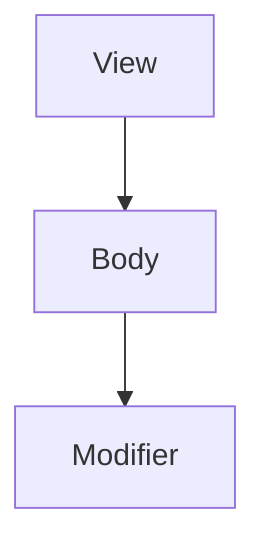

# 문체 및 서식 가이드

## 문체

### 톤
- **설명체** 사용: "~합니다", "~입니다" 체를 기본으로 한다.
- 독자를 존중하되 지나치게 격식적이지 않은 톤을 유지한다.
- 독자에게 말을 걸듯 자연스럽게 서술한다.

### 용어
- 처음 등장하는 기술 용어는 한글(영문) 형태로 병기한다.
  - 예: "프로토콜(Protocol)", "옵셔널(Optional)"
- 이후 등장 시에는 한글 또는 영문 중 더 자연스러운 것을 사용한다.
- 업계에서 영문 그대로 쓰는 용어는 영문을 유지한다.
  - 예: "View", "Modifier", "Property Wrapper"

### 주의 용어 표기
| 영문 | 한글 표기 |
|------|-----------|
| Generic | 제네릭 |
| Protocol | 프로토콜 |
| Optional | 옵셔널 |
| Closure | 클로저 |
| Property Wrapper | 프로퍼티 래퍼 |
| Concurrency | 동시성 |
| Actor | Actor (영문 유지) |
| Observable | 옵저버블 |
| Environment | 환경(Environment) |
| Modifier | 수정자(Modifier) |
| State | 상태(State) |
| Binding | 바인딩 |
| Existential Type | 존재적 타입(Existential Type) |
| Opaque Type | 불투명 타입(Opaque Type) |
| Associated Type | 연관 타입(Associated Type) |

> `Actor`는 ch03·ch14를 비롯해 원고 전반에서 영문으로 통일되어 있어 영문을 유지한다.
> `Existential`/`Opaque`/`Associated` 타입은 첫 등장 시 위 형태로 한글 병기하고, 이후에는 자연스러운 쪽을 쓴다.

## 예제 코드 작성 규칙

### 네이밍
- Swift API Design Guidelines을 따른다.
- 예제에서 사용하는 타입/변수명은 실무에서 쓸 법한 이름을 사용한다.
  - 좋은 예: `UserProfile`, `fetchArticles()`
  - 나쁜 예: `MyClass`, `doSomething()`

### 코드 스타일
- 들여쓰기: 4칸 스페이스
- 한 줄 최대 길이: 80자 권장 (인쇄 가독성)
- 불필요한 `self.` 사용을 피한다.
- 타입 추론이 명확한 경우 타입 어노테이션을 생략한다.

### 예제 난이도 표시
필요 시 예제 앞에 난이도를 표시한다:
- 🟢 기본: 개념을 이해하기 위한 최소 예제
- 🟡 중급: 실무에서 자주 만나는 패턴
- 🔴 고급: 깊은 이해가 필요한 심화 예제

난이도 마커는 **하위 섹션(`###`) 제목 바로 아래 독립 행**에 둔다. 도입 문단 뒤나 `##` 절 레벨에 흩어 놓지 않는다 — 장마다 위치가 달라지면 일관성이 깨진다.

## 그림/다이어그램

- 필요한 위치에 `[그림: 설명]` 플레이스홀더를 삽입한다.
- Mermaid 문법으로 표현 가능한 다이어그램은 Mermaid 코드 블록을 사용한다.



## 콜아웃(Callout)

보충 설명·주의·팁은 인용 블록(`>`) 콜아웃으로 표기한다.

- **영문 라벨만 사용한다.** 한글 라벨(`주의`/`경고`/`중요` 등)은 쓰지 않는다 — 장 간 일관성을 위해서다.
- 허용 라벨은 세 가지다:
  - `> **Note**:` — 보충 설명, 알아두면 좋은 점
  - `> **Warning**:` — 흔한 실수, 위험, 함정(pitfall)
  - `> **Tip**:` — 실무 팁, 권장 패턴
- 라벨 뒤에 콜론(`:`)을 붙이고 본문을 이어 쓴다.

```markdown
> **Warning**: `weak`를 잘못 쓰면 의도치 않게 nil이 됩니다.
```

## 장 분량 가이드
- 각 장: 본문 기준 약 20~40페이지 (A4)
- 코드 예제 비율: 전체의 30~40%
- 각 섹션은 한 번에 읽을 수 있는 분량(5~10분)으로 나눈다.
